# Polyglot Codebase Knowledge Graph

> Generated offline by **readmenator**. 18 files, 177 symbols, 113 imports. Supports C, C++, Python, Go, Rust, JS/TS, Java, C#, Shell, PHP, Dart, GDScript, Nim, ASM, Ruby, Swift, Kotlin, Scala, Lua, Elixir.
> No LLMs. No tokens. Pure static analysis. See more [here](https://github.com/grisuno/ReadMenator)

**Start here:** Statistics Dashboard for scope, God Nodes for blast radius, Architecture Reference for per-file API. Agents: prefer `readmenator-agent/INDEX.md` + `SYMBOLS.md`.

**Total Files Parsed:** 18 | **Total Symbols Extracted:** 177 | **Total Imports:** 113
 | **Resolved Imports:** 50

<!-- ranking_model: v1.0 | weights: {ppr:0.45,auth:0.2,test:0.15,doc:0.1,fresh:0.1} | alpha:0.85 | commit:b3ca3bb | date:2026-07-18 -->


## Table of Contents

1. [Statistics Dashboard](#statistics-dashboard)
2. [Architectural Layers](#architectural-layers)
3. [Ranked Context](#ranked-context)
4. [God Nodes](#god-nodes)
5. [Community Analysis](#community-analysis)
6. [Suggested Questions](#suggested-questions)
7. [Taint Propagation Map](#taint-propagation-map)
8. [Hotspot Analysis](#hotspot-analysis)
9. [Change Impact Analysis](#change-impact-analysis)
10. [Suggested Linting Rules](#suggested-linting-rules)
11. [Orphans](#orphans)
12. [Query Recipes](#query-recipes)
13. [Structural Knowledge Map](#structural-knowledge-map)
14. [UML Class Diagram](#uml-class-diagram)
15. [Code Property Graph](#code-property-graph)
16. [Architecture Reference](#architecture-reference)
    - [PY (18 files)](#py-18-files)

---

## Statistics Dashboard

| Metric | Value |
|--------|-------|
| Total Files | 18 |
| Total Symbols | 177 |
| Total Imports | 113 |
| Call Edges | 751 |
| Inheritance Edges | 4 |
| Languages | 1 |
| Avg Symbols/File | 9.8 |
| Avg Imports/File | 6.3 |
| Resolved Imports | 50 |

### Top Files by Import Count (Fan-Out)

| File | Imports | Symbols | Language |
|------|---------|---------|----------|
| `engine.py` | 12 | 19 | py |
| `runner.py` | 10 | 16 | py |
| `__main__.py` | 9 | 7 | py |
| `installer.py` | 9 | 6 | py |
| `__init__.py` | 8 | 0 | py |
| `test_engine.py` | 8 | 18 | py |
| `test_runner.py` | 8 | 14 | py |
| `conftest.py` | 7 | 7 | py |
| `placeholders.py` | 6 | 4 | py |
| `test_cli.py` | 6 | 11 | py |

---

## Architectural Layers

Auto-detected from path patterns, naming conventions, and imported frameworks.

| Layer | Files |
|-------|-------|
| testing | 9 |
| utility | 7 |
| infrastructure | 1 |
| business_logic | 1 |

### utility

- `__init__.py` (py, 0 symbols)
- `__main__.py` (py, 7 symbols)
- `engine.py` (py, 19 symbols)
- `installer.py` (py, 6 symbols)
- `placeholders.py` (py, 4 symbols)
- `runner.py` (py, 16 symbols)
- `security.py` (py, 6 symbols)

### infrastructure

- `config.py` (py, 1 symbols)

### business_logic

- `models.py` (py, 14 symbols)

### testing

- `__init__.py` (py, 0 symbols)
- `conftest.py` (py, 7 symbols)
- `test_cli.py` (py, 11 symbols)
- `test_engine.py` (py, 18 symbols)
- `test_models.py` (py, 17 symbols)
- `test_placeholders.py` (py, 13 symbols)
- `test_placeholders_property.py` (py, 3 symbols)
- `test_runner.py` (py, 14 symbols)
- `test_security.py` (py, 21 symbols)

---

## Ranked Context

Files ranked by composite score for the current query context. The ranking combines Personalized PageRank (query relevance), global authority, test coverage, documentation coverage, and code freshness. Model: v1.0.

| Rank | File | Composite | PPR | Authority | Test | Doc |
|------|------|-----------|-----|-----------|------|-----|
| 1 | `config.py` | 0.3115 | 0.3255 | 0.3255 | 0.00 | 1.00 |
| 2 | `models.py` | 0.1761 | 0.1170 | 0.1170 | 0.00 | 1.00 |
| 3 | `__main__.py` | 0.1232 | 0.0358 | 0.0358 | 0.00 | 1.00 |
| 4 | `security.py` | 0.1145 | 0.0480 | 0.0480 | 0.00 | 0.83 |
| 5 | `runner.py` | 0.1106 | 0.0644 | 0.0644 | 0.00 | 0.69 |
| 6 | `engine.py` | 0.1101 | 0.0479 | 0.0479 | 0.00 | 0.79 |
| 7 | `installer.py` | 0.1060 | 0.0349 | 0.0349 | 0.00 | 0.83 |
| 8 | `placeholders.py` | 0.1023 | 0.0804 | 0.0804 | 0.00 | 0.50 |
| 9 | `conftest.py` | 0.1009 | 0.0454 | 0.0454 | 0.00 | 0.71 |
| 10 | `test_cli.py` | 0.0254 | 0.0251 | 0.0251 | 0.00 | 0.09 |

---

## God Nodes

Most architecturally central files ranked by combined import/export degree and symbol richness.

| File | Score | Connections | PageRank |
|------|-------|-------------|----------|
| `config.py` | 30.1 | | 0.3255 |
| `models.py` | 23.4 | | 0.1170 |
| `engine.py` | 21.9 | | 0.0479 |
| `runner.py` | 17.6 | | 0.0644 |
| `installer.py` | 14.6 | | 0.0349 |
| `placeholders.py` | 14.4 | | 0.0804 |
| `__init__.py` | 14.0 | | 0.0000 |
| `security.py` | 12.6 | | 0.0480 |
| `test_runner.py` | 11.4 | | 0.0000 |
| `conftest.py` | 10.7 | | 0.0454 |

---

## Community Analysis

Files grouped by import-based community detection. Cohesion measures how tightly connected each community is internally.

### lazyaddon (Cohesion: 1.00)

**17 files** in this community:

- `__init__.py` (py, 0 symbols)
- `__main__.py` (py, 7 symbols)
- `config.py` (py, 1 symbols)
- `engine.py` (py, 19 symbols)
- `installer.py` (py, 6 symbols)
- `models.py` (py, 14 symbols)
- `placeholders.py` (py, 4 symbols)
- `runner.py` (py, 16 symbols)
- `security.py` (py, 6 symbols)
- `conftest.py` (py, 7 symbols)
- `test_cli.py` (py, 11 symbols)
- `test_engine.py` (py, 18 symbols)
- `test_models.py` (py, 17 symbols)
- `test_placeholders.py` (py, 13 symbols)
- `test_placeholders_property.py` (py, 3 symbols)
- `test_runner.py` (py, 14 symbols)
- `test_security.py` (py, 21 symbols)

---

## Suggested Questions

Auto-generated exploration prompts based on graph structure:

- What does config.py depend on, and what depends on it? (15 connections)
- What does models.py depend on, and what depends on it? (11 connections)
- What does engine.py depend on, and what depends on it? (10 connections)
- How are the 17 files in 'lazyaddon' related to each other?
- What is AddonConfig in config.py and how is it used?

---

## Taint Propagation Map

Taint analysis traces how dangerous imports propagate through the codebase via transitive dependencies. Source files import dangerous modules directly; sink files receive the danger indirectly.

**Taint Sources:** 1 | **Taint Sinks:** 4 | **Propagation Paths:** 4

- `runner.py` imports `subprocess` (0 hop to `runner.py`) [high]
  Path: runner.py
- `runner.py` imports `subprocess` (1 hop to `config.py`) [high]
  Path: runner.py -> config.py
- `runner.py` imports `subprocess` (1 hop to `placeholders.py`) [high]
  Path: runner.py -> placeholders.py
- `runner.py` imports `subprocess` (1 hop to `models.py`) [high]
  Path: runner.py -> models.py

---

## Hotspot Analysis

Files ranked by combined complexity (symbol count) and centrality (connection count). High-scoring files are architecturally critical and may need refactoring attention.

| File | Complexity | Centrality | Combined | Symbols | Connections |
|------|-----------|------------|----------|---------|-------------|
| `config.py` | 0.048 | 0.773 | 0.483 | 1 | 17 |
| `models.py` | 0.667 | 0.682 | 0.676 | 14 | 15 |
| `__main__.py` | 0.333 | 0.591 | 0.488 | 7 | 13 |
| `security.py` | 0.286 | 0.500 | 0.414 | 6 | 11 |
| `runner.py` | 0.762 | 0.818 | 0.796 | 16 | 18 |
| `engine.py` | 0.905 | 1.000 | 0.962 | 19 | 22 |
| `installer.py` | 0.286 | 0.727 | 0.551 | 6 | 16 |
| `placeholders.py` | 0.191 | 0.591 | 0.431 | 4 | 13 |
| `conftest.py` | 0.333 | 0.545 | 0.461 | 7 | 12 |
| `test_cli.py` | 0.524 | 0.364 | 0.428 | 11 | 8 |
| `test_engine.py` | 0.857 | 0.545 | 0.670 | 18 | 12 |
| `test_security.py` | 1.000 | 0.409 | 0.645 | 21 | 9 |
| `test_runner.py` | 0.667 | 0.591 | 0.621 | 14 | 13 |
| `test_models.py` | 0.809 | 0.273 | 0.487 | 17 | 6 |
| `test_placeholders.py` | 0.619 | 0.273 | 0.411 | 13 | 6 |

---

## Change Impact Analysis

Files sorted by how many other files would be affected if they changed. High-impact files should be changed with caution.

| File | Direct Dependents | Transitive Dependents | Total Impact |
|------|------------------|----------------------|--------------|
| `config.py` | 15 | 1 | 16 |
| `models.py` | 10 | 2 | 12 |
| `placeholders.py` | 6 | 5 | 11 |
| `runner.py` | 5 | 3 | 8 |
| `security.py` | 4 | 4 | 8 |
| `installer.py` | 2 | 4 | 6 |
| `engine.py` | 4 | 1 | 5 |
| `conftest.py` | 3 | 0 | 3 |
| `__main__.py` | 1 | 0 | 1 |
| `__init__.py` | 0 | 0 | 0 |
| `__init__.py` | 0 | 0 | 0 |
| `test_cli.py` | 0 | 0 | 0 |
| `test_engine.py` | 0 | 0 | 0 |
| `test_models.py` | 0 | 0 | 0 |
| `test_placeholders.py` | 0 | 0 | 0 |

---

## Suggested Linting Rules

Automatically suggested linting and security rules based on patterns detected in the codebase. These can be exported as Semgrep rules using the `--export-rules` flag.

| Rule ID | Severity | Description | Language | Matches |
|---------|----------|-------------|----------|---------|
| `RM001` | info | Large number of functions in py: 161 total | py | 161 |
| `RM002` | info | Print statement found (consider logging instead) | python | 20 |

---

## Orphans

Files with no documentation or low connectivity. These are candidates for documentation investment or cleanup.

- `__init__.py` (0 symbols, no doc)
- `__init__.py` (0 symbols, no doc)
- `test_engine.py` (18 symbols, no doc)
- `test_models.py` (17 symbols, no doc)
- `test_placeholders.py` (13 symbols, no doc)
- `test_placeholders_property.py` (3 symbols, no doc)
- `test_runner.py` (14 symbols, no doc)
- `test_security.py` (21 symbols, no doc)

---

## Query Recipes

Example queries you can run against this knowledge base using the ranking engine:

```
# Find files most relevant to a concept
readmenator query "Where is the import resolver implemented?"

# Rank files by relevance to a topic
readmenator query "How does documentation generation work?"

# Explain why a file ranks highly
readmenator query "explain readmenator/_documentation.py"

# Trace dependency paths with ranked context
readmenator query "path from CLI to exporter"
```

The ranking model uses the following signals:

- **Personalized PageRank** (45% weight): query-specific relevance via seed propagation
- **Global Authority** (20% weight): structural importance via standard PageRank
- **Test Coverage** (15% weight): fraction of symbols referenced in test files
- **Doc Coverage** (10% weight): presence of docstrings and file-level docs
- **Freshness** (10% weight): recent modification activity

Results include score decomposition and justification paths for each ranked item.

---

## Structural Knowledge Map

```mermaid
graph TD
    classDef mod fill:#1e1e1e,stroke:#ff6666,stroke-width:2px,color:#fff;
    classDef cls fill:#2d2d2d,stroke:#4ec9b0,stroke-width:2px,color:#fff;
    classDef fn fill:#333,stroke:#dcdcaa,stroke-width:1px,color:#dcdcaa;
    classDef ext fill:#111,stroke:#666,stroke-dasharray:5 5,color:#aaa;
    subgraph community_0 ["lazyaddon"]
    lazyaddon_engine_py["engine.py (py)"]
    class lazyaddon_engine_py mod;
    lazyaddon_engine_py_LazyAddonEngine["LazyAddonEngine"]
    class lazyaddon_engine_py_LazyAddonEngine cls;
    lazyaddon_engine_py --> lazyaddon_engine_py_LazyAddonEngine
    lazyaddon_engine_py__iter_yaml["_iter_yaml"]
    class lazyaddon_engine_py__iter_yaml fn;
    lazyaddon_engine_py --> lazyaddon_engine_py__iter_yaml
    lazyaddon_engine_py__safe_filename["_safe_filename"]
    class lazyaddon_engine_py__safe_filename fn;
    lazyaddon_engine_py --> lazyaddon_engine_py__safe_filename
    lazyaddon_engine_py__project_config["_project_config"]
    class lazyaddon_engine_py__project_config fn;
    lazyaddon_engine_py --> lazyaddon_engine_py__project_config
    lazyaddon_engine_py___init__["__init__"]
    class lazyaddon_engine_py___init__ fn;
    lazyaddon_engine_py --> lazyaddon_engine_py___init__
    lazyaddon___init___py["__init__.py (py)"]
    class lazyaddon___init___py mod;
    lazyaddon_installer_py["installer.py (py)"]
    class lazyaddon_installer_py mod;
    lazyaddon_runner_py["runner.py (py)"]
    class lazyaddon_runner_py mod;
    tests_test_runner_py["test_runner.py (py)"]
    class tests_test_runner_py mod;
    tests_test_engine_py["test_engine.py (py)"]
    class tests_test_engine_py mod;
    lazyaddon___main___py["__main__.py (py)"]
    class lazyaddon___main___py mod;
    tests_test_security_py["test_security.py (py)"]
    class tests_test_security_py mod;
    tests_conftest_py["conftest.py (py)"]
    class tests_conftest_py mod;
    tests_test_cli_py["test_cli.py (py)"]
    class tests_test_cli_py mod;
    lazyaddon_security_py["security.py (py)"]
    class lazyaddon_security_py mod;
    lazyaddon_placeholders_py["placeholders.py (py)"]
    class lazyaddon_placeholders_py mod;
    tests_test_placeholders_property_py["test_placeholders_property.py (py)"]
    class tests_test_placeholders_property_py mod;
    tests_test_models_py["test_models.py (py)"]
    class tests_test_models_py mod;
    tests_test_placeholders_py["test_placeholders.py (py)"]
    class tests_test_placeholders_py mod;
    lazyaddon_models_py["models.py (py)"]
    class lazyaddon_models_py mod;
    lazyaddon_config_py["config.py (py)"]
    class lazyaddon_config_py mod;
    tests___init___py["__init__.py (py)"]
    class tests___init___py mod;
    end
    lazyaddon___init___py -- resolved_imports --> lazyaddon_config_py
    lazyaddon___init___py -- resolved_imports --> lazyaddon_engine_py
    lazyaddon___init___py -- resolved_imports --> lazyaddon_installer_py
    lazyaddon___init___py -- resolved_imports --> lazyaddon_models_py
    lazyaddon___init___py -- resolved_imports --> lazyaddon_placeholders_py
    lazyaddon___init___py -- resolved_imports --> lazyaddon_runner_py
    lazyaddon___init___py -- resolved_imports --> lazyaddon_security_py
    lazyaddon___main___py -- resolved_imports --> lazyaddon_engine_py
    lazyaddon___main___py -- resolved_imports --> lazyaddon_models_py
    lazyaddon___main___py -- resolved_imports --> lazyaddon_config_py
    lazyaddon_engine_py -- resolved_imports --> lazyaddon_config_py
    lazyaddon_engine_py -- resolved_imports --> lazyaddon_installer_py
    lazyaddon_engine_py -- resolved_imports --> lazyaddon_models_py
    lazyaddon_engine_py -- resolved_imports --> lazyaddon_placeholders_py
    lazyaddon_engine_py -- resolved_imports --> lazyaddon_runner_py
    lazyaddon_engine_py -- resolved_imports --> lazyaddon_security_py
    lazyaddon_installer_py -- resolved_imports --> lazyaddon_config_py
    lazyaddon_installer_py -- resolved_imports --> lazyaddon_models_py
    lazyaddon_installer_py -- resolved_imports --> lazyaddon_placeholders_py
    lazyaddon_installer_py -- resolved_imports --> lazyaddon_runner_py
    lazyaddon_installer_py -- resolved_imports --> lazyaddon_security_py
    lazyaddon_models_py -- resolved_imports --> lazyaddon_config_py
    lazyaddon_placeholders_py -- resolved_imports --> lazyaddon_config_py
    lazyaddon_runner_py -- resolved_imports --> lazyaddon_config_py
    lazyaddon_runner_py -- resolved_imports --> lazyaddon_models_py
    lazyaddon_runner_py -- resolved_imports --> lazyaddon_placeholders_py
    lazyaddon_security_py -- resolved_imports --> lazyaddon_config_py
    lazyaddon_security_py -- resolved_imports --> lazyaddon_models_py
    tests_conftest_py -- resolved_imports --> lazyaddon_config_py
    tests_conftest_py -- resolved_imports --> lazyaddon_runner_py
    tests_test_cli_py -- resolved_imports --> lazyaddon___main___py
    tests_test_cli_py -- resolved_imports --> tests_conftest_py
    tests_test_engine_py -- resolved_imports --> lazyaddon_config_py
    tests_test_engine_py -- resolved_imports --> lazyaddon_engine_py
    tests_test_engine_py -- resolved_imports --> lazyaddon_models_py
    tests_test_engine_py -- resolved_imports --> tests_conftest_py
    tests_test_models_py -- resolved_imports --> lazyaddon_config_py
    tests_test_models_py -- resolved_imports --> lazyaddon_models_py
    tests_test_placeholders_py -- resolved_imports --> lazyaddon_config_py
    tests_test_placeholders_py -- resolved_imports --> lazyaddon_placeholders_py
    tests_test_placeholders_property_py -- resolved_imports --> lazyaddon_config_py
    tests_test_placeholders_property_py -- resolved_imports --> lazyaddon_placeholders_py
    tests_test_runner_py -- resolved_imports --> lazyaddon_engine_py
    tests_test_runner_py -- resolved_imports --> lazyaddon_models_py
    tests_test_runner_py -- resolved_imports --> lazyaddon_runner_py
    tests_test_runner_py -- resolved_imports --> tests_conftest_py
    tests_test_runner_py -- resolved_imports --> lazyaddon_config_py
    tests_test_security_py -- resolved_imports --> lazyaddon_config_py
    tests_test_security_py -- resolved_imports --> lazyaddon_models_py
    tests_test_security_py -- resolved_imports --> lazyaddon_security_py
    ext___future__["__future__"]
    class ext___future__ ext;
    lazyaddon___init___py -.->|imports| ext___future__
    ext_config["config"]
    class ext_config ext;
    lazyaddon___init___py -.->|imports| ext_config
    ext_engine["engine"]
    class ext_engine ext;
    lazyaddon___init___py -.->|imports| ext_engine
    ext_installer["installer"]
    class ext_installer ext;
    lazyaddon___init___py -.->|imports| ext_installer
    ext_models["models"]
    class ext_models ext;
    lazyaddon___init___py -.->|imports| ext_models
    ext_placeholders["placeholders"]
    class ext_placeholders ext;
    lazyaddon___init___py -.->|imports| ext_placeholders
    ext_runner["runner"]
    class ext_runner ext;
    lazyaddon___init___py -.->|imports| ext_runner
    ext_security["security"]
    class ext_security ext;
    lazyaddon___init___py -.->|imports| ext_security
    lazyaddon___main___py -.->|imports| ext___future__
    ext_argparse["argparse"]
    class ext_argparse ext;
    lazyaddon___main___py -.->|imports| ext_argparse
    ext_logging["logging"]
    class ext_logging ext;
    lazyaddon___main___py -.->|imports| ext_logging
    ext_sys["sys"]
    class ext_sys ext;
    lazyaddon___main___py -.->|imports| ext_sys
    ext_collections_abc["collections.abc"]
    class ext_collections_abc ext;
    lazyaddon___main___py -.->|imports| ext_collections_abc
    lazyaddon___main___py -.->|imports| ext_engine
    lazyaddon___main___py -.->|imports| ext_models
    lazyaddon___main___py -.->|imports| ext_config
    ext_json["json"]
    class ext_json ext;
    lazyaddon___main___py -.->|imports| ext_json
    lazyaddon_config_py -.->|imports| ext___future__
    ext_dataclasses["dataclasses"]
    class ext_dataclasses ext;
    lazyaddon_config_py -.->|imports| ext_dataclasses
    lazyaddon_engine_py -.->|imports| ext___future__
    lazyaddon_engine_py -.->|imports| ext_logging
    lazyaddon_engine_py -.->|imports| ext_collections_abc
    ext_pathlib["pathlib"]
    class ext_pathlib ext;
    lazyaddon_engine_py -.->|imports| ext_pathlib
    ext_typing["typing"]
    class ext_typing ext;
    lazyaddon_engine_py -.->|imports| ext_typing
    ext_yaml["yaml"]
    class ext_yaml ext;
    lazyaddon_engine_py -.->|imports| ext_yaml
    lazyaddon_engine_py -.->|imports| ext_config
    lazyaddon_engine_py -.->|imports| ext_installer
    lazyaddon_engine_py -.->|imports| ext_models
    lazyaddon_engine_py -.->|imports| ext_placeholders
    lazyaddon_engine_py -.->|imports| ext_runner
    lazyaddon_engine_py -.->|imports| ext_security
    lazyaddon_installer_py -.->|imports| ext___future__
    lazyaddon_installer_py -.->|imports| ext_collections_abc
    lazyaddon_installer_py -.->|imports| ext_pathlib
    lazyaddon_installer_py -.->|imports| ext_typing
    lazyaddon_installer_py -.->|imports| ext_config
    lazyaddon_installer_py -.->|imports| ext_models
    lazyaddon_installer_py -.->|imports| ext_placeholders
    lazyaddon_installer_py -.->|imports| ext_runner
    lazyaddon_installer_py -.->|imports| ext_security
    lazyaddon_models_py -.->|imports| ext___future__
    lazyaddon_models_py -.->|imports| ext_dataclasses
    lazyaddon_models_py -.->|imports| ext_typing
    lazyaddon_models_py -.->|imports| ext_config
    lazyaddon_placeholders_py -.->|imports| ext___future__
    ext_re["re"]
    class ext_re ext;
    lazyaddon_placeholders_py -.->|imports| ext_re
    ext_shlex["shlex"]
    class ext_shlex ext;
    lazyaddon_placeholders_py -.->|imports| ext_shlex
    lazyaddon_placeholders_py -.->|imports| ext_collections_abc
    lazyaddon_placeholders_py -.->|imports| ext_typing
    lazyaddon_placeholders_py -.->|imports| ext_config
    lazyaddon_runner_py -.->|imports| ext___future__
    ext_os["os"]
    class ext_os ext;
    lazyaddon_runner_py -.->|imports| ext_os
    ext_subprocess["subprocess"]
    class ext_subprocess ext;
    lazyaddon_runner_py -.->|imports| ext_subprocess
    lazyaddon_runner_py -.->|imports| ext_collections_abc
    lazyaddon_runner_py -.->|imports| ext_dataclasses
    lazyaddon_runner_py -.->|imports| ext_pathlib
    lazyaddon_runner_py -.->|imports| ext_typing
    lazyaddon_runner_py -.->|imports| ext_config
    lazyaddon_runner_py -.->|imports| ext_models
    lazyaddon_runner_py -.->|imports| ext_placeholders
    lazyaddon_security_py -.->|imports| ext___future__
    lazyaddon_security_py -.->|imports| ext_pathlib
    ext_urllib_parse["urllib.parse"]
    class ext_urllib_parse ext;
    lazyaddon_security_py -.->|imports| ext_urllib_parse
    lazyaddon_security_py -.->|imports| ext_config
    lazyaddon_security_py -.->|imports| ext_models
    tests_conftest_py -.->|imports| ext___future__
    tests_conftest_py -.->|imports| ext_collections_abc
    tests_conftest_py -.->|imports| ext_pathlib
    tests_conftest_py -.->|imports| ext_typing
    ext_pytest["pytest"]
    class ext_pytest ext;
    tests_conftest_py -.->|imports| ext_pytest
    ext_lazyaddon_config["lazyaddon.config"]
    class ext_lazyaddon_config ext;
    tests_conftest_py -.->|imports| ext_lazyaddon_config
    ext_lazyaddon_runner["lazyaddon.runner"]
    class ext_lazyaddon_runner ext;
    tests_conftest_py -.->|imports| ext_lazyaddon_runner
    tests_test_cli_py -.->|imports| ext___future__
    tests_test_cli_py -.->|imports| ext_pathlib
    tests_test_cli_py -.->|imports| ext_pytest
    tests_test_cli_py -.->|imports| ext_yaml
    ext_lazyaddon___main__["lazyaddon.__main__"]
    class ext_lazyaddon___main__ ext;
    tests_test_cli_py -.->|imports| ext_lazyaddon___main__
    ext_conftest["conftest"]
    class ext_conftest ext;
    tests_test_cli_py -.->|imports| ext_conftest
    tests_test_engine_py -.->|imports| ext___future__
    tests_test_engine_py -.->|imports| ext_pathlib
    tests_test_engine_py -.->|imports| ext_pytest
    tests_test_engine_py -.->|imports| ext_yaml
    tests_test_engine_py -.->|imports| ext_lazyaddon_config
    ext_lazyaddon_engine["lazyaddon.engine"]
    class ext_lazyaddon_engine ext;
    tests_test_engine_py -.->|imports| ext_lazyaddon_engine
    ext_lazyaddon_models["lazyaddon.models"]
    class ext_lazyaddon_models ext;
    tests_test_engine_py -.->|imports| ext_lazyaddon_models
    tests_test_engine_py -.->|imports| ext_conftest
    tests_test_models_py -.->|imports| ext___future__
    tests_test_models_py -.->|imports| ext_pytest
    tests_test_models_py -.->|imports| ext_lazyaddon_config
    tests_test_models_py -.->|imports| ext_lazyaddon_models
    tests_test_placeholders_py -.->|imports| ext___future__
    tests_test_placeholders_py -.->|imports| ext_pytest
    tests_test_placeholders_py -.->|imports| ext_lazyaddon_config
    ext_lazyaddon_placeholders["lazyaddon.placeholders"]
    class ext_lazyaddon_placeholders ext;
    tests_test_placeholders_py -.->|imports| ext_lazyaddon_placeholders
    tests_test_placeholders_property_py -.->|imports| ext___future__
    ext_hypothesis["hypothesis"]
    class ext_hypothesis ext;
    tests_test_placeholders_property_py -.->|imports| ext_hypothesis
    tests_test_placeholders_property_py -.->|imports| ext_hypothesis
    tests_test_placeholders_property_py -.->|imports| ext_lazyaddon_config
    tests_test_placeholders_property_py -.->|imports| ext_lazyaddon_placeholders
    tests_test_runner_py -.->|imports| ext___future__
    tests_test_runner_py -.->|imports| ext_pathlib
    tests_test_runner_py -.->|imports| ext_pytest
    tests_test_runner_py -.->|imports| ext_lazyaddon_engine
    tests_test_runner_py -.->|imports| ext_lazyaddon_models
    tests_test_runner_py -.->|imports| ext_lazyaddon_runner
    tests_test_runner_py -.->|imports| ext_conftest
    tests_test_runner_py -.->|imports| ext_lazyaddon_config
    tests_test_security_py -.->|imports| ext___future__
    tests_test_security_py -.->|imports| ext_pathlib
    tests_test_security_py -.->|imports| ext_pytest
    tests_test_security_py -.->|imports| ext_lazyaddon_config
    tests_test_security_py -.->|imports| ext_lazyaddon_models
    ext_lazyaddon_security["lazyaddon.security"]
    class ext_lazyaddon_security ext;
    tests_test_security_py -.->|imports| ext_lazyaddon_security
```



---

## UML Class Diagram

Auto-generated Mermaid class diagram from parsed class-level symbols. Shows classes, structs, interfaces, traits, and their methods with inheritance and dependency relationships.

```mermaid
classDiagram
  class config_py_AddonConfig {
    <<class>>
  }
  class engine_py_LazyAddonEngine {
    <<class>>
    +_iter_yaml(base, suffixes)
    +_safe_filename(name)
    +_project_config(base, data)
    +__init__(self, config, runner, hooks)
    +discover(self)
    +get(self, name)
    +all(self)
    +names(self)
    +build_params(self, addon, overrides)
    +install(self, addon, overrides)
  }
  class installer_py_AddonInstaller {
    <<class>>
    +__init__(self, config, runner, placeholders, security)
    +install_path(self, addon)
    +is_installed(self, addon)
    +install(self, addon, params)
    +_clone(self, repo_url, target)
  }
  class models_py_AddonError {
    <<class>>
    +_require_name(raw)
    +_as_params(value)
    +_build_param(raw, config)
    +_build_tool(name, raw, config)
    +_as_str_dict(value)
    +_as_str_tuple(value)
    +loads(cls, raw, config)
    +param_by_name(self, name)
    +required_params(self)
  }
  class models_py_SchemaError {
    <<class>>
    +_require_name(raw)
    +_as_params(value)
    +_build_param(raw, config)
    +_build_tool(name, raw, config)
    +_as_str_dict(value)
    +_as_str_tuple(value)
    +loads(cls, raw, config)
    +param_by_name(self, name)
    +required_params(self)
  }
  class models_py_AddonParam {
    <<class>>
    +_require_name(raw)
    +_as_params(value)
    +_build_param(raw, config)
    +_build_tool(name, raw, config)
    +_as_str_dict(value)
    +_as_str_tuple(value)
    +loads(cls, raw, config)
    +param_by_name(self, name)
    +required_params(self)
  }
  class models_py_ToolSpec {
    <<class>>
    +_require_name(raw)
    +_as_params(value)
    +_build_param(raw, config)
    +_build_tool(name, raw, config)
    +_as_str_dict(value)
    +_as_str_tuple(value)
    +loads(cls, raw, config)
    +param_by_name(self, name)
    +required_params(self)
  }
  class models_py_AddonSpec {
    <<class>>
    +_require_name(raw)
    +_as_params(value)
    +_build_param(raw, config)
    +_build_tool(name, raw, config)
    +_as_str_dict(value)
    +_as_str_tuple(value)
    +loads(cls, raw, config)
    +param_by_name(self, name)
    +required_params(self)
  }
  class placeholders_py_PlaceholderEngine {
    <<class>>
    +__init__(self, config)
    +resolve(self, command, params, untrusted_keys)
    +_replacement(self, match, params, untrusted)
  }
  class runner_py_CommandResult {
    <<class>>
    +ok(self)
    +run(self, command, cwd, env, timeout)
    +__init__(self, timeout_seconds, environment)
    +run(self, command, cwd, env, timeout)
    +__call__(self, kind, payload, env)
    +execute(self, addon, params, extra_args, cwd, untrusted_keys)
    +dispatch_hooks(self, addon, params, untrusted_keys)
    +_dispatch_hooks(self, addon, params, untrusted, env)
    +_resolve_env(self, addon, params, untrusted)
    +_default_untrusted(self, addon)
  }
  class runner_py_ProcessRunner {
    <<class>>
    +ok(self)
    +run(self, command, cwd, env, timeout)
    +__init__(self, timeout_seconds, environment)
    +run(self, command, cwd, env, timeout)
    +__call__(self, kind, payload, env)
    +execute(self, addon, params, extra_args, cwd, untrusted_keys)
    +dispatch_hooks(self, addon, params, untrusted_keys)
    +_dispatch_hooks(self, addon, params, untrusted, env)
    +_resolve_env(self, addon, params, untrusted)
    +_default_untrusted(self, addon)
  }
  class runner_py_CommandRunner {
    <<class>>
    +ok(self)
    +run(self, command, cwd, env, timeout)
    +__init__(self, timeout_seconds, environment)
    +run(self, command, cwd, env, timeout)
    +__call__(self, kind, payload, env)
    +execute(self, addon, params, extra_args, cwd, untrusted_keys)
    +dispatch_hooks(self, addon, params, untrusted_keys)
    +_dispatch_hooks(self, addon, params, untrusted, env)
    +_resolve_env(self, addon, params, untrusted)
    +_default_untrusted(self, addon)
  }
  class runner_py_AddonHook {
    <<class>>
    +ok(self)
    +run(self, command, cwd, env, timeout)
    +__init__(self, timeout_seconds, environment)
    +run(self, command, cwd, env, timeout)
    +__call__(self, kind, payload, env)
    +execute(self, addon, params, extra_args, cwd, untrusted_keys)
    +dispatch_hooks(self, addon, params, untrusted_keys)
    +_dispatch_hooks(self, addon, params, untrusted, env)
    +_resolve_env(self, addon, params, untrusted)
    +_default_untrusted(self, addon)
  }
  class runner_py_AddonRunner {
    <<class>>
    +ok(self)
    +run(self, command, cwd, env, timeout)
    +__init__(self, timeout_seconds, environment)
    +run(self, command, cwd, env, timeout)
    +__call__(self, kind, payload, env)
    +execute(self, addon, params, extra_args, cwd, untrusted_keys)
    +dispatch_hooks(self, addon, params, untrusted_keys)
    +_dispatch_hooks(self, addon, params, untrusted, env)
    +_resolve_env(self, addon, params, untrusted)
    +_default_untrusted(self, addon)
  }
  class security_py_SecurityPolicy {
    <<class>>
    +__init__(self, config)
    +validate_addon(self, addon)
    +validate_repo_url(self, url)
    +validate_command(self, command, label)
    +resolve_install_path(self, install_path)
  }
  class conftest_py_FakeRunner {
    <<class>>
    +make_config(tmp_path)
    +runner()
    +__init__(self)
    +run(self, command, cwd, env, timeout)
    +last(self)
    +commands(self)
  }
```



---

## Code Property Graph

Machine-readable Code Property Graph (CPG) in JSON-LD format. This block allows AI agents to parse the full structural graph without additional file reads. Compatible with GraphRAG pipelines.

```json
{"@context": "https://schema.org", "analysis": {"communities": [{"cohesion": 1.0, "id": 0, "label": "lazyaddon", "size": 17}], "god_nodes": [{"node_id": "lazyaddon/config.py", "score": 30.1}, {"node_id": "lazyaddon/models.py", "score": 23.4}, {"node_id": "lazyaddon/engine.py", "score": 21.9}, {"node_id": "lazyaddon/runner.py", "score": 17.6}, {"node_id": "lazyaddon/installer.py", "score": 14.6}, {"node_id": "lazyaddon/placeholders.py", "score": 14.4}, {"node_id": "lazyaddon/__init__.py", "score": 14.0}, {"node_id": "lazyaddon/security.py", "score": 12.6}, {"node_id": "tests/test_runner.py", "score": 11.4}, {"node_id": "tests/conftest.py", "score": 10.7}], "surprising_connections": []}, "edges": [{"confidence": "EXTRACTED", "relation": "imports", "source": "lazyaddon/__init__.py", "target": "__future__"}, {"confidence": "EXTRACTED", "relation": "imports", "source": "lazyaddon/__init__.py", "target": "config"}, {"confidence": "EXTRACTED", "relation": "imports", "source": "lazyaddon/__init__.py", "target": "engine"}, {"confidence": "EXTRACTED", "relation": "imports", "source": "lazyaddon/__init__.py", "target": "installer"}, {"confidence": "EXTRACTED", "relation": "imports", "source": "lazyaddon/__init__.py", "target": "models"}, {"confidence": "EXTRACTED", "relation": "imports", "source": "lazyaddon/__init__.py", "target": "placeholders"}, {"confidence": "EXTRACTED", "relation": "imports", "source": "lazyaddon/__init__.py", "target": "runner"}, {"confidence": "EXTRACTED", "relation": "imports", "source": "lazyaddon/__init__.py", "target": "security"}, {"confidence": "EXTRACTED", "relation": "imports", "source": "lazyaddon/__main__.py", "target": "__future__"}, {"confidence": "EXTRACTED", "relation": "imports", "source": "lazyaddon/__main__.py", "target": "argparse"}, {"confidence": "EXTRACTED", "relation": "imports", "source": "lazyaddon/__main__.py", "target": "logging"}, {"confidence": "EXTRACTED", "relation": "imports", "source": "lazyaddon/__main__.py", "target": "sys"}, {"confidence": "EXTRACTED", "relation": "imports", "source": "lazyaddon/__main__.py", "target": "collections.abc"}, {"confidence": "EXTRACTED", "relation": "imports", "source": "lazyaddon/__main__.py", "target": "engine"}, {"confidence": "EXTRACTED", "relation": "imports", "source": "lazyaddon/__main__.py", "target": "models"}, {"confidence": "EXTRACTED", "relation": "imports", "source": "lazyaddon/__main__.py", "target": "config"}, {"confidence": "EXTRACTED", "relation": "imports", "source": "lazyaddon/__main__.py", "target": "json"}, {"confidence": "EXTRACTED", "relation": "imports", "source": "lazyaddon/config.py", "target": "__future__"}, {"confidence": "EXTRACTED", "relation": "imports", "source": "lazyaddon/config.py", "target": "dataclasses"}, {"confidence": "EXTRACTED", "relation": "imports", "source": "lazyaddon/engine.py", "target": "__future__"}, {"confidence": "EXTRACTED", "relation": "imports", "source": "lazyaddon/engine.py", "target": "logging"}, {"confidence": "EXTRACTED", "relation": "imports", "source": "lazyaddon/engine.py", "target": "collections.abc"}, {"confidence": "EXTRACTED", "relation": "imports", "source": "lazyaddon/engine.py", "target": "pathlib"}, {"confidence": "EXTRACTED", "relation": "imports", "source": "lazyaddon/engine.py", "target": "typing"}, {"confidence": "EXTRACTED", "relation": "imports", "source": "lazyaddon/engine.py", "target": "yaml"}, {"confidence": "EXTRACTED", "relation": "imports", "source": "lazyaddon/engine.py", "target": "config"}, {"confidence": "EXTRACTED", "relation": "imports", "source": "lazyaddon/engine.py", "target": "installer"}, {"confidence": "EXTRACTED", "relation": "imports", "source": "lazyaddon/engine.py", "target": "models"}, {"confidence": "EXTRACTED", "relation": "imports", "source": "lazyaddon/engine.py", "target": "placeholders"}, {"confidence": "EXTRACTED", "relation": "imports", "source": "lazyaddon/engine.py", "target": "runner"}, {"confidence": "EXTRACTED", "relation": "imports", "source": "lazyaddon/engine.py", "target": "security"}, {"confidence": "EXTRACTED", "relation": "imports", "source": "lazyaddon/installer.py", "target": "__future__"}, {"confidence": "EXTRACTED", "relation": "imports", "source": "lazyaddon/installer.py", "target": "collections.abc"}, {"confidence": "EXTRACTED", "relation": "imports", "source": "lazyaddon/installer.py", "target": "pathlib"}, {"confidence": "EXTRACTED", "relation": "imports", "source": "lazyaddon/installer.py", "target": "typing"}, {"confidence": "EXTRACTED", "relation": "imports", "source": "lazyaddon/installer.py", "target": "config"}, {"confidence": "EXTRACTED", "relation": "imports", "source": "lazyaddon/installer.py", "target": "models"}, {"confidence": "EXTRACTED", "relation": "imports", "source": "lazyaddon/installer.py", "target": "placeholders"}, {"confidence": "EXTRACTED", "relation": "imports", "source": "lazyaddon/installer.py", "target": "runner"}, {"confidence": "EXTRACTED", "relation": "imports", "source": "lazyaddon/installer.py", "target": "security"}, {"confidence": "EXTRACTED", "relation": "imports", "source": "lazyaddon/models.py", "target": "__future__"}, {"confidence": "EXTRACTED", "relation": "imports", "source": "lazyaddon/models.py", "target": "dataclasses"}, {"confidence": "EXTRACTED", "relation": "imports", "source": "lazyaddon/models.py", "target": "typing"}, {"confidence": "EXTRACTED", "relation": "imports", "source": "lazyaddon/models.py", "target": "config"}, {"confidence": "EXTRACTED", "relation": "imports", "source": "lazyaddon/placeholders.py", "target": "__future__"}, {"confidence": "EXTRACTED", "relation": "imports", "source": "lazyaddon/placeholders.py", "target": "re"}, {"confidence": "EXTRACTED", "relation": "imports", "source": "lazyaddon/placeholders.py", "target": "shlex"}, {"confidence": "EXTRACTED", "relation": "imports", "source": "lazyaddon/placeholders.py", "target": "collections.abc"}, {"confidence": "EXTRACTED", "relation": "imports", "source": "lazyaddon/placeholders.py", "target": "typing"}, {"confidence": "EXTRACTED", "relation": "imports", "source": "lazyaddon/placeholders.py", "target": "config"}, {"confidence": "EXTRACTED", "relation": "imports", "source": "lazyaddon/runner.py", "target": "__future__"}, {"confidence": "EXTRACTED", "relation": "imports", "source": "lazyaddon/runner.py", "target": "os"}, {"confidence": "EXTRACTED", "relation": "imports", "source": "lazyaddon/runner.py", "target": "subprocess"}, {"confidence": "EXTRACTED", "relation": "imports", "source": "lazyaddon/runner.py", "target": "collections.abc"}, {"confidence": "EXTRACTED", "relation": "imports", "source": "lazyaddon/runner.py", "target": "dataclasses"}, {"confidence": "EXTRACTED", "relation": "imports", "source": "lazyaddon/runner.py", "target": "pathlib"}, {"confidence": "EXTRACTED", "relation": "imports", "source": "lazyaddon/runner.py", "target": "typing"}, {"confidence": "EXTRACTED", "relation": "imports", "source": "lazyaddon/runner.py", "target": "config"}, {"confidence": "EXTRACTED", "relation": "imports", "source": "lazyaddon/runner.py", "target": "models"}, {"confidence": "EXTRACTED", "relation": "imports", "source": "lazyaddon/runner.py", "target": "placeholders"}, {"confidence": "EXTRACTED", "relation": "imports", "source": "lazyaddon/security.py", "target": "__future__"}, {"confidence": "EXTRACTED", "relation": "imports", "source": "lazyaddon/security.py", "target": "pathlib"}, {"confidence": "EXTRACTED", "relation": "imports", "source": "lazyaddon/security.py", "target": "urllib.parse"}, {"confidence": "EXTRACTED", "relation": "imports", "source": "lazyaddon/security.py", "target": "config"}, {"confidence": "EXTRACTED", "relation": "imports", "source": "lazyaddon/security.py", "target": "models"}, {"confidence": "EXTRACTED", "relation": "imports", "source": "tests/conftest.py", "target": "__future__"}, {"confidence": "EXTRACTED", "relation": "imports", "source": "tests/conftest.py", "target": "collections.abc"}, {"confidence": "EXTRACTED", "relation": "imports", "source": "tests/conftest.py", "target": "pathlib"}, {"confidence": "EXTRACTED", "relation": "imports", "source": "tests/conftest.py", "target": "typing"}, {"confidence": "EXTRACTED", "relation": "imports", "source": "tests/conftest.py", "target": "pytest"}, {"confidence": "EXTRACTED", "relation": "imports", "source": "tests/conftest.py", "target": "lazyaddon.config"}, {"confidence": "EXTRACTED", "relation": "imports", "source": "tests/conftest.py", "target": "lazyaddon.runner"}, {"confidence": "EXTRACTED", "relation": "imports", "source": "tests/test_cli.py", "target": "__future__"}, {"confidence": "EXTRACTED", "relation": "imports", "source": "tests/test_cli.py", "target": "pathlib"}, {"confidence": "EXTRACTED", "relation": "imports", "source": "tests/test_cli.py", "target": "pytest"}, {"confidence": "EXTRACTED", "relation": "imports", "source": "tests/test_cli.py", "target": "yaml"}, {"confidence": "EXTRACTED", "relation": "imports", "source": "tests/test_cli.py", "target": "lazyaddon.__main__"}, {"confidence": "EXTRACTED", "relation": "imports", "source": "tests/test_cli.py", "target": "conftest"}, {"confidence": "EXTRACTED", "relation": "imports", "source": "tests/test_engine.py", "target": "__future__"}, {"confidence": "EXTRACTED", "relation": "imports", "source": "tests/test_engine.py", "target": "pathlib"}, {"confidence": "EXTRACTED", "relation": "imports", "source": "tests/test_engine.py", "target": "pytest"}, {"confidence": "EXTRACTED", "relation": "imports", "source": "tests/test_engine.py", "target": "yaml"}, {"confidence": "EXTRACTED", "relation": "imports", "source": "tests/test_engine.py", "target": "lazyaddon.config"}, {"confidence": "EXTRACTED", "relation": "imports", "source": "tests/test_engine.py", "target": "lazyaddon.engine"}, {"confidence": "EXTRACTED", "relation": "imports", "source": "tests/test_engine.py", "target": "lazyaddon.models"}, {"confidence": "EXTRACTED", "relation": "imports", "source": "tests/test_engine.py", "target": "conftest"}, {"confidence": "EXTRACTED", "relation": "imports", "source": "tests/test_models.py", "target": "__future__"}, {"confidence": "EXTRACTED", "relation": "imports", "source": "tests/test_models.py", "target": "pytest"}, {"confidence": "EXTRACTED", "relation": "imports", "source": "tests/test_models.py", "target": "lazyaddon.config"}, {"confidence": "EXTRACTED", "relation": "imports", "source": "tests/test_models.py", "target": "lazyaddon.models"}, {"confidence": "EXTRACTED", "relation": "imports", "source": "tests/test_placeholders.py", "target": "__future__"}, {"confidence": "EXTRACTED", "relation": "imports", "source": "tests/test_placeholders.py", "target": "pytest"}, {"confidence": "EXTRACTED", "relation": "imports", "source": "tests/test_placeholders.py", "target": "lazyaddon.config"}, {"confidence": "EXTRACTED", "relation": "imports", "source": "tests/test_placeholders.py", "target": "lazyaddon.placeholders"}, {"confidence": "EXTRACTED", "relation": "imports", "source": "tests/test_placeholders_property.py", "target": "__future__"}, {"confidence": "EXTRACTED", "relation": "imports", "source": "tests/test_placeholders_property.py", "target": "hypothesis"}, {"confidence": "EXTRACTED", "relation": "imports", "source": "tests/test_placeholders_property.py", "target": "hypothesis"}, {"confidence": "EXTRACTED", "relation": "imports", "source": "tests/test_placeholders_property.py", "target": "lazyaddon.config"}, {"confidence": "EXTRACTED", "relation": "imports", "source": "tests/test_placeholders_property.py", "target": "lazyaddon.placeholders"}, {"confidence": "EXTRACTED", "relation": "imports", "source": "tests/test_runner.py", "target": "__future__"}, {"confidence": "EXTRACTED", "relation": "imports", "source": "tests/test_runner.py", "target": "pathlib"}, {"confidence": "EXTRACTED", "relation": "imports", "source": "tests/test_runner.py", "target": "pytest"}, {"confidence": "EXTRACTED", "relation": "imports", "source": "tests/test_runner.py", "target": "lazyaddon.engine"}, {"confidence": "EXTRACTED", "relation": "imports", "source": "tests/test_runner.py", "target": "lazyaddon.models"}, {"confidence": "EXTRACTED", "relation": "imports", "source": "tests/test_runner.py", "target": "lazyaddon.runner"}, {"confidence": "EXTRACTED", "relation": "imports", "source": "tests/test_runner.py", "target": "conftest"}, {"confidence": "EXTRACTED", "relation": "imports", "source": "tests/test_runner.py", "target": "lazyaddon.config"}, {"confidence": "EXTRACTED", "relation": "imports", "source": "tests/test_security.py", "target": "__future__"}, {"confidence": "EXTRACTED", "relation": "imports", "source": "tests/test_security.py", "target": "pathlib"}, {"confidence": "EXTRACTED", "relation": "imports", "source": "tests/test_security.py", "target": "pytest"}, {"confidence": "EXTRACTED", "relation": "imports", "source": "tests/test_security.py", "target": "lazyaddon.config"}, {"confidence": "EXTRACTED", "relation": "imports", "source": "tests/test_security.py", "target": "lazyaddon.models"}, {"confidence": "EXTRACTED", "relation": "imports", "source": "tests/test_security.py", "target": "lazyaddon.security"}, {"confidence": "EXTRACTED", "relation": "resolved_imports", "source": "lazyaddon/__init__.py", "target": "lazyaddon/config.py"}, {"confidence": "EXTRACTED", "relation": "resolved_imports", "source": "lazyaddon/__init__.py", "target": "lazyaddon/engine.py"}, {"confidence": "EXTRACTED", "relation": "resolved_imports", "source": "lazyaddon/__init__.py", "target": "lazyaddon/installer.py"}, {"confidence": "EXTRACTED", "relation": "resolved_imports", "source": "lazyaddon/__init__.py", "target": "lazyaddon/models.py"}, {"confidence": "EXTRACTED", "relation": "resolved_imports", "source": "lazyaddon/__init__.py", "target": "lazyaddon/placeholders.py"}, {"confidence": "EXTRACTED", "relation": "resolved_imports", "source": "lazyaddon/__init__.py", "target": "lazyaddon/runner.py"}, {"confidence": "EXTRACTED", "relation": "resolved_imports", "source": "lazyaddon/__init__.py", "target": "lazyaddon/security.py"}, {"confidence": "EXTRACTED", "relation": "resolved_imports", "source": "lazyaddon/__main__.py", "target": "lazyaddon/engine.py"}, {"confidence": "EXTRACTED", "relation": "resolved_imports", "source": "lazyaddon/__main__.py", "target": "lazyaddon/models.py"}, {"confidence": "EXTRACTED", "relation": "resolved_imports", "source": "lazyaddon/__main__.py", "target": "lazyaddon/config.py"}, {"confidence": "EXTRACTED", "relation": "resolved_imports", "source": "lazyaddon/engine.py", "target": "lazyaddon/config.py"}, {"confidence": "EXTRACTED", "relation": "resolved_imports", "source": "lazyaddon/engine.py", "target": "lazyaddon/installer.py"}, {"confidence": "EXTRACTED", "relation": "resolved_imports", "source": "lazyaddon/engine.py", "target": "lazyaddon/models.py"}, {"confidence": "EXTRACTED", "relation": "resolved_imports", "source": "lazyaddon/engine.py", "target": "lazyaddon/placeholders.py"}, {"confidence": "EXTRACTED", "relation": "resolved_imports", "source": "lazyaddon/engine.py", "target": "lazyaddon/runner.py"}, {"confidence": "EXTRACTED", "relation": "resolved_imports", "source": "lazyaddon/engine.py", "target": "lazyaddon/security.py"}, {"confidence": "EXTRACTED", "relation": "resolved_imports", "source": "lazyaddon/installer.py", "target": "lazyaddon/config.py"}, {"confidence": "EXTRACTED", "relation": "resolved_imports", "source": "lazyaddon/installer.py", "target": "lazyaddon/models.py"}, {"confidence": "EXTRACTED", "relation": "resolved_imports", "source": "lazyaddon/installer.py", "target": "lazyaddon/placeholders.py"}, {"confidence": "EXTRACTED", "relation": "resolved_imports", "source": "lazyaddon/installer.py", "target": "lazyaddon/runner.py"}, {"confidence": "EXTRACTED", "relation": "resolved_imports", "source": "lazyaddon/installer.py", "target": "lazyaddon/security.py"}, {"confidence": "EXTRACTED", "relation": "resolved_imports", "source": "lazyaddon/models.py", "target": "lazyaddon/config.py"}, {"confidence": "EXTRACTED", "relation": "resolved_imports", "source": "lazyaddon/placeholders.py", "target": "lazyaddon/config.py"}, {"confidence": "EXTRACTED", "relation": "resolved_imports", "source": "lazyaddon/runner.py", "target": "lazyaddon/config.py"}, {"confidence": "EXTRACTED", "relation": "resolved_imports", "source": "lazyaddon/runner.py", "target": "lazyaddon/models.py"}, {"confidence": "EXTRACTED", "relation": "resolved_imports", "source": "lazyaddon/runner.py", "target": "lazyaddon/placeholders.py"}, {"confidence": "EXTRACTED", "relation": "resolved_imports", "source": "lazyaddon/security.py", "target": "lazyaddon/config.py"}, {"confidence": "EXTRACTED", "relation": "resolved_imports", "source": "lazyaddon/security.py", "target": "lazyaddon/models.py"}, {"confidence": "EXTRACTED", "relation": "resolved_imports", "source": "tests/conftest.py", "target": "lazyaddon/config.py"}, {"confidence": "EXTRACTED", "relation": "resolved_imports", "source": "tests/conftest.py", "target": "lazyaddon/runner.py"}, {"confidence": "EXTRACTED", "relation": "resolved_imports", "source": "tests/test_cli.py", "target": "lazyaddon/__main__.py"}, {"confidence": "EXTRACTED", "relation": "resolved_imports", "source": "tests/test_cli.py", "target": "tests/conftest.py"}, {"confidence": "EXTRACTED", "relation": "resolved_imports", "source": "tests/test_engine.py", "target": "lazyaddon/config.py"}, {"confidence": "EXTRACTED", "relation": "resolved_imports", "source": "tests/test_engine.py", "target": "lazyaddon/engine.py"}, {"confidence": "EXTRACTED", "relation": "resolved_imports", "source": "tests/test_engine.py", "target": "lazyaddon/models.py"}, {"confidence": "EXTRACTED", "relation": "resolved_imports", "source": "tests/test_engine.py", "target": "tests/conftest.py"}, {"confidence": "EXTRACTED", "relation": "resolved_imports", "source": "tests/test_models.py", "target": "lazyaddon/config.py"}, {"confidence": "EXTRACTED", "relation": "resolved_imports", "source": "tests/test_models.py", "target": "lazyaddon/models.py"}, {"confidence": "EXTRACTED", "relation": "resolved_imports", "source": "tests/test_placeholders.py", "target": "lazyaddon/config.py"}, {"confidence": "EXTRACTED", "relation": "resolved_imports", "source": "tests/test_placeholders.py", "target": "lazyaddon/placeholders.py"}, {"confidence": "EXTRACTED", "relation": "resolved_imports", "source": "tests/test_placeholders_property.py", "target": "lazyaddon/config.py"}, {"confidence": "EXTRACTED", "relation": "resolved_imports", "source": "tests/test_placeholders_property.py", "target": "lazyaddon/placeholders.py"}, {"confidence": "EXTRACTED", "relation": "resolved_imports", "source": "tests/test_runner.py", "target": "lazyaddon/engine.py"}, {"confidence": "EXTRACTED", "relation": "resolved_imports", "source": "tests/test_runner.py", "target": "lazyaddon/models.py"}, {"confidence": "EXTRACTED", "relation": "resolved_imports", "source": "tests/test_runner.py", "target": "lazyaddon/runner.py"}, {"confidence": "EXTRACTED", "relation": "resolved_imports", "source": "tests/test_runner.py", "target": "tests/conftest.py"}, {"confidence": "EXTRACTED", "relation": "resolved_imports", "source": "tests/test_runner.py", "target": "lazyaddon/config.py"}, {"confidence": "EXTRACTED", "relation": "resolved_imports", "source": "tests/test_security.py", "target": "lazyaddon/config.py"}, {"confidence": "EXTRACTED", "relation": "resolved_imports", "source": "tests/test_security.py", "target": "lazyaddon/models.py"}, {"confidence": "EXTRACTED", "relation": "resolved_imports", "source": "tests/test_security.py", "target": "lazyaddon/security.py"}], "generator": "readmenator", "metadata": {"edge_count": 918, "file_count": 18, "language_count": 1, "symbol_count": 177}, "nodes": [{"id": "lazyaddon/__init__.py", "kind": "module", "label": "__init__.py", "language": "py", "sha256": "65d0f59ec5a3fc68", "symbol_count": 0, "symbols": []}, {"id": "lazyaddon/__main__.py", "kind": "module", "label": "__main__.py", "language": "py", "sha256": "f65b389486f85118", "symbol_count": 7, "symbols": [{"doc": "Build the CLI argument parser.", "kind": "function", "line": 20, "name": "build_parser", "signature": "def build_parser()"}, {"doc": "Build an engine honouring the CLI-level directory overrides.", "kind": "function", "line": 81, "name": "_make_engine", "signature": "def _make_engine(args)"}, {"doc": "Parse ``key=value`` CLI overrides into a parameter mapping.", "kind": "function", "line": 92, "name": "_parse_overrides", "signature": "def _parse_overrides(raw)"}, {"doc": "Run the lazyaddon CLI.", "kind": "function", "line": 103, "name": "main", "signature": "def main(argv)"}, {"doc": "Route a parsed command to its handler.", "kind": "function", "line": 118, "name": "_dispatch", "signature": "def _dispatch(args, parser)"}, {"doc": "Build a compact serialisable summary of an addon.", "kind": "function", "line": 197, "name": "_summary", "signature": "def _summary(addon)"}, {"doc": "Serialize ``payload`` to a compact JSON string.", "kind": "function", "line": 223, "name": "_json", "signature": "def _json(payload)"}]}, {"id": "lazyaddon/config.py", "kind": "module", "label": "config.py", "language": "py", "sha256": "ccd42ceeb6207fb3", "symbol_count": 1, "symbols": [{"doc": "Immutable engine configuration.\n\nAttributes:\n    addons_dir: Base directory where addon YAML files are discovered.\n    install_root: Directory under which cloned repos are placed. Resolving\n        against this root prevents path traversal from ``install_path``.\n    allowed_repo_hosts: Hostnames permitted in ``repo_url``. Empty means\n        any https host is accepted (handy for GitLab mirrors).\n    allowed_repo_schemes: URL schemes permitted for ``repo_url``.\n    clone_depth: Depth passed to ``git clone --depth``.\n    command_timeout_seconds: Maximum seconds a subprocess may run.\n    default_os: OS label applied when an addon omits ``os``.\n    default_category: Category applied when an addon omits ``category``.\n    default_param_type: Type label applied when a param omits ``type``.\n    max_repo_url_length: Rejection ceiling for oversized ``repo_url``.\n    max_command_length: Rejection ceiling for command strings.\n    yaml_suffixes: File extensions scanned when discovering addons.\n    placeholder_open: Left placeholder delimiter.\n    placeholder_close: Right placeholder delimiter.\n    quote_runtime_values: Shell-quote runtime-injected param values before\n        substitution into commands that run under a shell.\n    allowed_os_values: Recognised OS labels; anything else falls back to\n        ``default_os``.\n    environment: Environment variables injected into every subprocess.", "kind": "class", "line": 33, "name": "AddonConfig", "signature": "class AddonConfig"}]}, {"id": "lazyaddon/engine.py", "kind": "module", "label": "engine.py", "language": "py", "sha256": "180ace59fb23dbd2", "symbol_count": 19, "symbols": [{"doc": "High-level addon management and execution engine.\n\nArgs:\n    config: Engine configuration; defaults to a fresh :class:`AddonConfig`.\n    runner: Process runner override (mainly for tests).\n    hooks: Mapping of hook kind to host-implemented handler.", "kind": "class", "line": 32, "name": "LazyAddonEngine", "signature": "class LazyAddonEngine"}, {"doc": "Return sorted YAML files under ``base`` matching ``suffixes``.", "kind": "method", "line": 388, "name": "_iter_yaml", "signature": "def _iter_yaml(base, suffixes)"}, {"doc": "Sanitise an addon name into a safe filename token.", "kind": "method", "line": 396, "name": "_safe_filename", "signature": "def _safe_filename(name)"}, {"doc": "Derive an updated config from optional project overrides.", "kind": "method", "line": 402, "name": "_project_config", "signature": "def _project_config(base, data)"}, {"kind": "method", "line": 41, "name": "__init__", "signature": "def __init__(self, config, runner, hooks)"}, {"doc": "Scan ``addons_dir`` and load every enabled addon into the registry.\n\nReturns:\n    The list of discovered, validated addons.", "kind": "method", "line": 60, "name": "discover", "signature": "def discover(self)"}, {"doc": "Return the addon registered under ``name``, if any.", "kind": "method", "line": 77, "name": "get", "signature": "def get(self, name)"}, {"doc": "Return all currently registered addons.", "kind": "method", "line": 81, "name": "all", "signature": "def all(self)"}, {"doc": "Return the sorted names of all registered addons.", "kind": "method", "line": 85, "name": "names", "signature": "def names(self)"}, {"doc": "Merge declared defaults with runtime overrides.\n\nArgs:\n    addon: The addon whose params are being resolved.\n    overrides: Runtime-supplied parameter values.\n\nReturns:\n    A ``(merged, untrusted)`` pair where ``merged`` is the resolved\n    parameter mapping and ``untrusted`` is the set of keys whose values\n    must be shell-quoted before substitution.\n\nRaises:\n    AddonError: If a required parameter is missing a value.", "kind": "method", "line": 90, "name": "build_params", "signature": "def build_params(self, addon, overrides)"}, {"doc": "Install (clone and build) an addon if not already present.\n\nArgs:\n    addon: The addon to install.\n    overrides: Runtime params for install_command placeholders.\n    force: Reinstall even if the directory already exists.", "kind": "method", "line": 127, "name": "install", "signature": "def install(self, addon, overrides)"}, {"doc": "Run a named addon through the full lifecycle.\n\nArgs:\n    name: Addon name as registered.\n    overrides: Runtime parameter values.\n    extra_args: Extra arguments appended to the execute command.\n    install: When True, install the addon first if needed.\n\nReturns:\n    The executed command result.\n\nRaises:\n    KeyError: If the addon name is unknown.\n    SchemaError: If the addon fails security validation.", "kind": "method", "line": 145, "name": "run", "signature": "def run(self, name, overrides, extra_args)"}, {"doc": "Register a new addon by writing its YAML to ``addons_dir``.\n\nArgs:\n    raw: Addon schema mapping (or a simplified marketplace form).\n    filename: Optional explicit filename; defaults to ``<name>.yaml``.\n    category: Optional category override applied to the document.\n\nReturns:\n    The path of the written addon file.\n\nRaises:\n    SchemaError: If the resulting addon is invalid.", "kind": "method", "line": 185, "name": "add", "signature": "def add(self, raw, filename)"}, {"doc": "Convenience builder for a tool-style addon.\n\nArgs:\n    name: Addon name.\n    repo_url: Upstream repository URL.\n    execute_command: Command run on execution.\n    install_path: Relative install destination directory.\n    install_command: Command run after cloning.\n    description: Addon description.\n    category: Category label.\n    enabled: Whether the addon is active.\n    params: Declared parameter list.\n\nReturns:\n    The path of the written addon file.", "kind": "method", "line": 218, "name": "add_from_tool", "signature": "def add_from_tool(self, name, repo_url, execute_command)"}, {"doc": "Delete the addon file registered under ``name``.\n\nArgs:\n    name: Addon name to remove.\n\nReturns:\n    The deleted path, or None if no file was found.", "kind": "method", "line": 262, "name": "remove", "signature": "def remove(self, name)"}, {"doc": "Execute a declarative project file for non-programmers.\n\nProject schema:\n\n.. code-block:: yaml\n\n    install_root: external\n    addons_dir: addons\n    addons:\n      - name: beacon\n        install: true\n        run: true\n        params:\n          lhost: 10.0.0.1\n\nArgs:\n    project_path: Path to the project YAML.\n\nReturns:\n    The results of every executed addon.\n\nRaises:\n    AddonError: If the project file is malformed.", "kind": "method", "line": 281, "name": "run_project", "signature": "def run_project(self, project_path)"}, {"kind": "method", "line": 340, "name": "_load_file", "signature": "def _load_file(self, path)"}, {"kind": "method", "line": 364, "name": "_addon_path", "signature": "def _addon_path(self, name, filename)"}, {"kind": "method", "line": 373, "name": "_find_addon_file", "signature": "def _find_addon_file(self, name)"}]}, {"id": "lazyaddon/installer.py", "kind": "module", "label": "installer.py", "language": "py", "sha256": "b539f24a1aa50be2", "symbol_count": 6, "symbols": [{"doc": "Clones and builds addons on disk.\n\nArgs:\n    config: Engine configuration.\n    runner: Process runner used for ``git clone`` and install commands.\n    placeholders: Placeholder engine for resolving install commands.\n    security: Security policy validating URLs and install paths.", "kind": "class", "line": 23, "name": "AddonInstaller", "signature": "class AddonInstaller"}, {"kind": "method", "line": 33, "name": "__init__", "signature": "def __init__(self, config, runner, placeholders, security)"}, {"doc": "Return the resolved on-disk install directory for an addon.\n\nArgs:\n    addon: The addon to inspect.\n\nReturns:\n    The validated absolute install directory, or None when the addon\n    declares no ``install_path``.", "kind": "method", "line": 45, "name": "install_path", "signature": "def install_path(self, addon)"}, {"doc": "Return True when the addon's install directory already exists.\n\nArgs:\n    addon: The addon to inspect.\n\nReturns:\n    True if the addon declares no install path or its directory exists.", "kind": "method", "line": 60, "name": "is_installed", "signature": "def is_installed(self, addon)"}, {"doc": "Clone and build an addon, skipping already-installed directories.\n\nArgs:\n    addon: The addon to install.\n    params: Runtime parameter values used for install_command tokens.\n    force: When True, reinstall even if the directory already exists.\n\nRaises:\n    ValueError: If the addon declares no ``repo_url``.\n    SchemaError: If the repo URL or install path is not permitted.", "kind": "method", "line": 72, "name": "install", "signature": "def install(self, addon, params)"}, {"doc": "Clone ``repo_url`` into ``target`` using a shallow checkout.", "kind": "method", "line": 108, "name": "_clone", "signature": "def _clone(self, repo_url, target)"}]}, {"id": "lazyaddon/models.py", "kind": "module", "label": "models.py", "language": "py", "sha256": "b7951a706f1eaca8", "symbol_count": 14, "symbols": [{"doc": "Base error raised for any lazyaddon schema or runtime failure.", "kind": "class", "line": 53, "name": "AddonError", "signature": "class AddonError(Exception)"}, {"doc": "Raised when an addon document violates the expected schema.", "kind": "class", "line": 57, "name": "SchemaError", "signature": "class SchemaError(AddonError)"}, {"doc": "A single declared input parameter for an addon.\n\nAttributes:\n    name: Unique parameter identifier referenced inside placeholders.\n    type: Optional type label; preserved for tooling and documentation.\n    required: Whether the value must be supplied at runtime.\n    description: Human-readable explanation of the parameter.\n    default: Trusted fallback value used when no runtime value is given.", "kind": "class", "line": 62, "name": "AddonParam", "signature": "class AddonParam"}, {"doc": "Executable description of the tool an addon wraps.\n\nAttributes:\n    name: Canonical tool name.\n    repo_url: https URL of the upstream project (clone source).\n    install_path: Relative destination directory under the install root.\n    install_command: Command run inside ``install_path`` after cloning.\n    execute_command: Command run when the addon is executed.\n    lazycommand: Optional framework command chain, dispatched via the\n        host's lazy-command hook.\n    remote_command: Optional remote/agent command, dispatched via the\n        remote-command hook.\n    upload_file: Comma-separated files sent to a connected agent.\n    download_file: Comma-separated files fetched from an agent.\n    env: Environment variables injected for the command, with placeholders\n        resolved at runtime.", "kind": "class", "line": 81, "name": "ToolSpec", "signature": "class ToolSpec"}, {"doc": "A fully validated addon definition.\n\nAttributes:\n    name: Unique addon identifier.\n    description: Long-form description.\n    author: Original author of the addon.\n    version: Human-readable version string.\n    enabled: Whether the addon may be executed.\n    os: Target OS label; one of :data:`AddonConfig.allowed_os_values`.\n    category: Palette/category label used for grouping and marketplaces.\n    params: Declared input parameters.\n    trigger: Service names that suggest this addon during recon.\n    tool: Executable tool definition.", "kind": "class", "line": 113, "name": "AddonSpec", "signature": "class AddonSpec"}, {"doc": "Extract and validate the required addon name field.", "kind": "method", "line": 188, "name": "_require_name", "signature": "def _require_name(raw)"}, {"doc": "Coerce the ``params`` field into a tuple of mappings.", "kind": "method", "line": 196, "name": "_as_params", "signature": "def _as_params(value)"}, {"doc": "Normalise a single parameter mapping into an ``AddonParam``.", "kind": "method", "line": 209, "name": "_build_param", "signature": "def _build_param(raw, config)"}, {"doc": "Build and length-check the executable tool definition.", "kind": "method", "line": 225, "name": "_build_tool", "signature": "def _build_tool(name, raw, config)"}, {"doc": "Coerce an env mapping into ``{str: str}``.", "kind": "method", "line": 242, "name": "_as_str_dict", "signature": "def _as_str_dict(value)"}, {"doc": "Coerce a trigger list into a tuple of strings.", "kind": "method", "line": 253, "name": "_as_str_tuple", "signature": "def _as_str_tuple(value)"}, {"doc": "Build a validated ``AddonSpec`` from a parsed YAML mapping.\n\nArgs:\n    raw: Parsed YAML document for a single addon.\n    config: Engine configuration governing defaults and limits.\n\nReturns:\n    A normalised, validated addon specification.\n\nRaises:\n    SchemaError: If the document is malformed or exceeds safety limits.", "kind": "method", "line": 141, "name": "loads", "signature": "def loads(cls, raw, config)"}, {"doc": "Return the declared parameter matching ``name`` or None.", "kind": "method", "line": 176, "name": "param_by_name", "signature": "def param_by_name(self, name)"}, {"doc": "Return the names of all required parameters in declaration order.", "kind": "method", "line": 183, "name": "required_params", "signature": "def required_params(self)"}]}, {"id": "lazyaddon/placeholders.py", "kind": "module", "label": "placeholders.py", "language": "py", "sha256": "555278bed586cab5", "symbol_count": 4, "symbols": [{"doc": "Resolves placeholder tokens within command strings.\n\nArgs:\n    config: Engine configuration controlling delimiters and quoting.", "kind": "class", "line": 27, "name": "PlaceholderEngine", "signature": "class PlaceholderEngine"}, {"kind": "method", "line": 34, "name": "__init__", "signature": "def __init__(self, config)"}, {"doc": "Substitute placeholders in ``command`` using ``params``.\n\nArgs:\n    command: String possibly containing ``{name}`` or ``{{ name }}``\n        tokens.\n    params: Mapping of placeholder name to value.\n    untrusted_keys: Param names whose values come from an untrusted\n        runtime source and must be shell-quoted before substitution.\n        When None, every key present in ``params`` is treated as\n        untrusted (the conservative default).\n\nReturns:\n    The command with every known placeholder replaced.\n\nRaises:\n    TypeError: If ``command`` is not a string.", "kind": "method", "line": 37, "name": "resolve", "signature": "def resolve(self, command, params, untrusted_keys)"}, {"kind": "method", "line": 70, "name": "_replacement", "signature": "def _replacement(self, match, params, untrusted)"}]}, {"id": "lazyaddon/runner.py", "kind": "module", "label": "runner.py", "language": "py", "sha256": "97a9ecc049f43cb7", "symbol_count": 16, "symbols": [{"doc": "Outcome of a shell command execution.\n\nAttributes:\n    command: The fully resolved command that was executed.\n    returncode: Process exit code.\n    stdout: Captured standard output text.\n    stderr: Captured standard error text.", "kind": "class", "line": 30, "name": "CommandResult", "signature": "class CommandResult"}, {"doc": "Minimal protocol satisfied by :class:`CommandRunner` and test fakes.", "kind": "class", "line": 51, "name": "ProcessRunner", "signature": "class ProcessRunner(Protocol)"}, {"doc": "Executes shell command strings via :func:`subprocess.run`.\n\nArgs:\n    timeout_seconds: Default timeout applied when none is passed.\n    environment: Base environment merged with per-call overrides.", "kind": "class", "line": 64, "name": "CommandRunner", "signature": "class CommandRunner"}, {"doc": "Protocol for a single extensible lazyaddon hook.\n\nImplementations are provided by the host application to handle\nframework-specific command families (lazycommand, remote_command,\nupload_file, download_file). Returning normally indicates success.", "kind": "class", "line": 124, "name": "AddonHook", "signature": "class AddonHook(Protocol)"}, {"doc": "Resolves and dispatches an addon's executable command.\n\nArgs:\n    config: Engine configuration.\n    runner: Process runner used for the primary execute command.\n    placeholders: Placeholder engine used for token substitution.\n    hooks: Mapping of hook kind to host-implemented handler. Any kind\n        without a handler is skipped.", "kind": "class", "line": 143, "name": "AddonRunner", "signature": "class AddonRunner"}, {"doc": "True when the process exited with code zero.", "kind": "method", "line": 46, "name": "ok", "signature": "def ok(self)"}, {"doc": "Execute ``command`` and return its result.", "kind": "method", "line": 54, "name": "run", "signature": "def run(self, command, cwd, env, timeout)"}, {"kind": "method", "line": 72, "name": "__init__", "signature": "def __init__(self, timeout_seconds, environment)"}, {"doc": "Execute ``command`` under a shell and capture its output.\n\nArgs:\n    command: Shell command string.\n    cwd: Working directory for the subprocess.\n    env: Extra environment overrides merged over the base environment.\n    timeout: Seconds to wait before raising; defaults to the runner's\n        configured timeout.\n\nReturns:\n    The captured command result.\n\nRaises:\n    subprocess.TimeoutExpired: If the command exceeds the timeout.", "kind": "method", "line": 80, "name": "run", "signature": "def run(self, command, cwd, env, timeout)"}, {"doc": "Handle one hook payload.\n\nArgs:\n    kind: Hook kind, e.g. ``lazy``, ``remote``, ``upload``, ``download``.\n    payload: Comma-separated payload string resolved against params.\n    env: Resolved environment variables for the addon.", "kind": "method", "line": 132, "name": "__call__", "signature": "def __call__(self, kind, payload, env)"}, {"doc": "Resolve and run the addon's ``execute_command``.\n\nArgs:\n    addon: The addon to execute.\n    params: Runtime parameter values.\n    extra_args: Extra positional arguments appended to the command.\n    cwd: Working directory; when None, runs from the addon's\n        ``install_path`` if present, else the current directory.\n    untrusted_keys: Param names whose values must be shell-quoted.\n        When None, every key without a trusted YAML default is treated\n        as untrusted.\n\nReturns:\n    The result of the executed command.\n\nRaises:\n    ValueError: If the addon has no ``execute_command``.", "kind": "method", "line": 159, "name": "execute", "signature": "def execute(self, addon, params, extra_args, cwd, untrusted_keys)"}, {"doc": "Dispatch framework-specific hooks declared on an addon.\n\nArgs:\n    addon: The addon whose hooks should fire.\n    params: Runtime parameter values.\n    untrusted_keys: Param names to treat as untrusted (quoted). When\n        None, every key without a trusted YAML default is untrusted.", "kind": "method", "line": 199, "name": "dispatch_hooks", "signature": "def dispatch_hooks(self, addon, params, untrusted_keys)"}, {"kind": "method", "line": 218, "name": "_dispatch_hooks", "signature": "def _dispatch_hooks(self, addon, params, untrusted, env)"}, {"kind": "method", "line": 241, "name": "_resolve_env", "signature": "def _resolve_env(self, addon, params, untrusted)"}, {"kind": "method", "line": 252, "name": "_default_untrusted", "signature": "def _default_untrusted(self, addon)"}, {"kind": "method", "line": 255, "name": "_tool_cwd", "signature": "def _tool_cwd(self, addon)"}]}, {"id": "lazyaddon/security.py", "kind": "module", "label": "security.py", "language": "py", "sha256": "c93197c430623e80", "symbol_count": 6, "symbols": [{"doc": "Validates external inputs before they reach the engine.\n\nArgs:\n    config: Engine configuration governing allowed hosts, schemes, lengths\n        and the install root.", "kind": "class", "line": 27, "name": "SecurityPolicy", "signature": "class SecurityPolicy"}, {"kind": "method", "line": 35, "name": "__init__", "signature": "def __init__(self, config)"}, {"doc": "Validate the network, filesystem and command fields of an addon.\n\nArgs:\n    addon: The addon to validate.\n\nRaises:\n    SchemaError: If any security boundary is violated.", "kind": "method", "line": 38, "name": "validate_addon", "signature": "def validate_addon(self, addon)"}, {"doc": "Validate a repository URL and return it unchanged.\n\nArgs:\n    url: Repository URL, typically a GitHub/GitLab clone source.\n\nReturns:\n    The validated URL.\n\nRaises:\n    SchemaError: If the scheme, host or length is not permitted.", "kind": "method", "line": 60, "name": "validate_repo_url", "signature": "def validate_repo_url(self, url)"}, {"doc": "Validate a shell command string for length and null bytes.\n\nArgs:\n    command: The command string to validate.\n    label: Human-readable label used in error messages.\n\nRaises:\n    SchemaError: If the command is malformed.", "kind": "method", "line": 86, "name": "validate_command", "signature": "def validate_command(self, command, label)"}, {"doc": "Resolve an addon install path inside the configured install root.\n\nArgs:\n    install_path: Relative destination directory from the addon.\n\nReturns:\n    The resolved, validated absolute path.\n\nRaises:\n    SchemaError: If the path escapes the install root.", "kind": "method", "line": 103, "name": "resolve_install_path", "signature": "def resolve_install_path(self, install_path)"}]}, {"id": "tests/__init__.py", "kind": "module", "label": "__init__.py", "language": "py", "sha256": "f813c53b4d1cc74f", "symbol_count": 0, "symbols": []}, {"id": "tests/conftest.py", "kind": "module", "label": "conftest.py", "language": "py", "sha256": "4a35fd0668347e1d", "symbol_count": 7, "symbols": [{"doc": "In-process substitute for :class:`CommandRunner`.", "kind": "class", "line": 19, "name": "FakeRunner", "signature": "class FakeRunner"}, {"doc": "Build an isolated config rooted at ``tmp_path``.", "kind": "method", "line": 79, "name": "make_config", "signature": "def make_config(tmp_path)"}, {"doc": "Yield a fresh fake process runner.", "kind": "method", "line": 88, "name": "runner", "signature": "def runner()"}, {"kind": "method", "line": 22, "name": "__init__", "signature": "def __init__(self)"}, {"kind": "method", "line": 27, "name": "run", "signature": "def run(self, command, cwd, env, timeout)"}, {"doc": "Return the most recent invocation.", "kind": "method", "line": 44, "name": "last", "signature": "def last(self)"}, {"doc": "Return all recorded command strings.", "kind": "method", "line": 49, "name": "commands", "signature": "def commands(self)"}]}, {"id": "tests/test_cli.py", "kind": "module", "label": "test_cli.py", "language": "py", "sha256": "8cd086ade7fea986", "symbol_count": 11, "symbols": [{"doc": "Invoke the CLI, capturing its exit code via SystemExit.", "kind": "function", "line": 15, "name": "_run", "signature": "def _run(argv)"}, {"kind": "function", "line": 24, "name": "test_list_empty_directory", "signature": "def test_list_empty_directory(tmp_path, monkeypatch)"}, {"kind": "function", "line": 29, "name": "test_add_then_list_and_show", "signature": "def test_add_then_list_and_show(tmp_path, monkeypatch)"}, {"kind": "function", "line": 50, "name": "test_show_unknown_addon_fails", "signature": "def test_show_unknown_addon_fails(tmp_path, monkeypatch)"}, {"kind": "function", "line": 55, "name": "test_add_rejects_insecure_repo", "signature": "def test_add_rejects_insecure_repo(tmp_path, monkeypatch)"}, {"kind": "function", "line": 68, "name": "test_remove_addon", "signature": "def test_remove_addon(tmp_path, monkeypatch)"}, {"kind": "function", "line": 76, "name": "test_run_addon_missing_param_fails", "signature": "def test_run_addon_missing_param_fails(tmp_path, monkeypatch)"}, {"kind": "function", "line": 86, "name": "test_version_flag", "signature": "def test_version_flag(tmp_path, monkeypatch)"}, {"kind": "function", "line": 92, "name": "test_list_json_emits_machine_readable", "signature": "def test_list_json_emits_machine_readable(tmp_path, monkeypatch)"}, {"kind": "function", "line": 102, "name": "test_run_success_executes_addon", "signature": "def test_run_success_executes_addon(tmp_path, monkeypatch)"}, {"kind": "function", "line": 120, "name": "test_project_success", "signature": "def test_project_success(tmp_path, monkeypatch)"}]}, {"id": "tests/test_engine.py", "kind": "module", "label": "test_engine.py", "language": "py", "sha256": "8946fdb255134623", "symbol_count": 18, "symbols": [{"kind": "function", "line": 17, "name": "_write_addon", "signature": "def _write_addon(tmp_path, data, name)"}, {"kind": "function", "line": 26, "name": "_engine", "signature": "def _engine(tmp_path, runner)"}, {"kind": "function", "line": 31, "name": "test_discover_finds_enabled_addons", "signature": "def test_discover_finds_enabled_addons(tmp_path, runner)"}, {"kind": "function", "line": 40, "name": "test_discover_skips_disabled_addons", "signature": "def test_discover_skips_disabled_addons(tmp_path, runner)"}, {"kind": "function", "line": 48, "name": "test_discover_skips_invalid_and_insecure", "signature": "def test_discover_skips_invalid_and_insecure(tmp_path, runner)"}, {"kind": "function", "line": 55, "name": "test_run_full_lifecycle", "signature": "def test_run_full_lifecycle(tmp_path, runner)"}, {"kind": "function", "line": 65, "name": "test_run_unknown_name_raises", "signature": "def test_run_unknown_name_raises(tmp_path, runner)"}, {"kind": "function", "line": 72, "name": "test_run_disabled_raises", "signature": "def test_run_disabled_raises(tmp_path, runner)"}, {"kind": "function", "line": 81, "name": "test_run_missing_required_param_raises", "signature": "def test_run_missing_required_param_raises(tmp_path, runner)"}, {"kind": "function", "line": 89, "name": "test_run_no_install_leaves_install_alone", "signature": "def test_run_no_install_leaves_install_alone(tmp_path, runner)"}, {"kind": "function", "line": 97, "name": "test_run_with_extra_args", "signature": "def test_run_with_extra_args(tmp_path, runner)"}, {"kind": "function", "line": 105, "name": "test_add_registers_new_addon", "signature": "def test_add_registers_new_addon(tmp_path, runner)"}, {"kind": "function", "line": 120, "name": "test_add_rejects_insecure_repo", "signature": "def test_add_rejects_insecure_repo(tmp_path, runner)"}, {"kind": "function", "line": 126, "name": "test_remove_deletes_file", "signature": "def test_remove_deletes_file(tmp_path, runner)"}, {"kind": "function", "line": 136, "name": "test_remove_unknown_returns_none", "signature": "def test_remove_unknown_returns_none(tmp_path, runner)"}, {"kind": "function", "line": 141, "name": "test_run_project_file", "signature": "def test_run_project_file(tmp_path, runner)"}, {"kind": "function", "line": 170, "name": "test_run_project_unknown_addon_raises", "signature": "def test_run_project_unknown_addon_raises(tmp_path, runner)"}, {"kind": "function", "line": 181, "name": "test_run_project_malformed_raises", "signature": "def test_run_project_malformed_raises(tmp_path, runner)"}]}, {"id": "tests/test_models.py", "kind": "module", "label": "test_models.py", "language": "py", "sha256": "0241bf98e88ecb36", "symbol_count": 17, "symbols": [{"kind": "function", "line": 11, "name": "_load", "signature": "def _load(raw, config)"}, {"kind": "function", "line": 15, "name": "test_minimal_addon_defaults", "signature": "def test_minimal_addon_defaults()"}, {"kind": "function", "line": 24, "name": "test_full_addon_parses_params_and_tool", "signature": "def test_full_addon_parses_params_and_tool()"}, {"kind": "function", "line": 71, "name": "test_unknown_os_falls_back_to_default", "signature": "def test_unknown_os_falls_back_to_default()"}, {"kind": "function", "line": 77, "name": "test_all_allowed_os_values_are_accepted", "signature": "def test_all_allowed_os_values_are_accepted(os_value)"}, {"kind": "function", "line": 82, "name": "test_missing_name_raises", "signature": "def test_missing_name_raises()"}, {"kind": "function", "line": 87, "name": "test_empty_name_raises", "signature": "def test_empty_name_raises()"}, {"kind": "function", "line": 92, "name": "test_missing_tool_mapping_raises", "signature": "def test_missing_tool_mapping_raises()"}, {"kind": "function", "line": 97, "name": "test_param_without_name_raises", "signature": "def test_param_without_name_raises()"}, {"kind": "function", "line": 102, "name": "test_non_required_param_defaults_to_optional", "signature": "def test_non_required_param_defaults_to_optional()"}, {"kind": "function", "line": 107, "name": "test_disabled_flag_is_preserved", "signature": "def test_disabled_flag_is_preserved()"}, {"kind": "function", "line": 112, "name": "test_trigger_string_is_split", "signature": "def test_trigger_string_is_split()"}, {"kind": "function", "line": 117, "name": "test_default_param_trusted_lookup", "signature": "def test_default_param_trusted_lookup()"}, {"kind": "function", "line": 129, "name": "test_param_type_and_description_defaults", "signature": "def test_param_type_and_description_defaults()"}, {"kind": "function", "line": 136, "name": "test_param_custom_type_and_description_are_kept", "signature": "def test_param_custom_type_and_description_are_kept()"}, {"kind": "function", "line": 149, "name": "test_tool_name_falls_back_to_addon_name", "signature": "def test_tool_name_falls_back_to_addon_name()"}, {"kind": "function", "line": 154, "name": "test_tool_name_custom_wins", "signature": "def test_tool_name_custom_wins()"}]}, {"id": "tests/test_placeholders.py", "kind": "module", "label": "test_placeholders.py", "language": "py", "sha256": "c402c5c990a76bf5", "symbol_count": 13, "symbols": [{"kind": "function", "line": 11, "name": "_engine", "signature": "def _engine()"}, {"kind": "function", "line": 15, "name": "test_single_brace_substitution", "signature": "def test_single_brace_substitution()"}, {"kind": "function", "line": 21, "name": "test_double_brace_substitution", "signature": "def test_double_brace_substitution()"}, {"kind": "function", "line": 25, "name": "test_whitespace_inside_braces_is_ignored", "signature": "def test_whitespace_inside_braces_is_ignored()"}, {"kind": "function", "line": 29, "name": "test_unknown_placeholder_left_untouched", "signature": "def test_unknown_placeholder_left_untouched()"}, {"kind": "function", "line": 33, "name": "test_no_placeholders_is_passthrough", "signature": "def test_no_placeholders_is_passthrough()"}, {"kind": "function", "line": 37, "name": "test_repeated_placeholder_all_replaced", "signature": "def test_repeated_placeholder_all_replaced()"}, {"kind": "function", "line": 42, "name": "test_runtime_values_are_shell_quoted", "signature": "def test_runtime_values_are_shell_quoted()"}, {"kind": "function", "line": 47, "name": "test_trusted_values_are_not_quoted", "signature": "def test_trusted_values_are_not_quoted()"}, {"kind": "function", "line": 52, "name": "test_quoted_value_survives_dangerous_metachars", "signature": "def test_quoted_value_survives_dangerous_metachars()"}, {"kind": "function", "line": 57, "name": "test_null_char_value_is_quoted_not_bare", "signature": "def test_null_char_value_is_quoted_not_bare()"}, {"kind": "function", "line": 63, "name": "test_quote_disabled_by_config", "signature": "def test_quote_disabled_by_config()"}, {"kind": "function", "line": 68, "name": "test_non_string_command_raises", "signature": "def test_non_string_command_raises()"}]}, {"id": "tests/test_placeholders_property.py", "kind": "module", "label": "test_placeholders_property.py", "language": "py", "sha256": "cc5ecc86a60e7483", "symbol_count": 3, "symbols": [{"kind": "function", "line": 22, "name": "test_known_single_token_resolves", "signature": "def test_known_single_token_resolves(key, value)"}, {"kind": "function", "line": 30, "name": "test_unknown_token_left_untouched", "signature": "def test_unknown_token_left_untouched(key, value)"}, {"kind": "function", "line": 38, "name": "test_untrusted_value_is_never_bare_metachar", "signature": "def test_untrusted_value_is_never_bare_metachar(value)"}]}, {"id": "tests/test_runner.py", "kind": "module", "label": "test_runner.py", "language": "py", "sha256": "d6624e0e6041cf05", "symbol_count": 14, "symbols": [{"kind": "function", "line": 16, "name": "_engine", "signature": "def _engine(tmp_path, runner)"}, {"kind": "function", "line": 21, "name": "AddonConfigFixture", "signature": "def AddonConfigFixture(tmp_path)"}, {"kind": "function", "line": 27, "name": "_addon", "signature": "def _addon()"}, {"kind": "function", "line": 31, "name": "test_installer_clones_and_builds", "signature": "def test_installer_clones_and_builds(tmp_path, runner)"}, {"kind": "function", "line": 42, "name": "test_installer_skips_when_already_installed", "signature": "def test_installer_skips_when_already_installed(tmp_path, runner)"}, {"kind": "function", "line": 52, "name": "test_installer_force_reinstalls", "signature": "def test_installer_force_reinstalls(tmp_path, runner)"}, {"kind": "function", "line": 62, "name": "test_installer_requires_repo_url", "signature": "def test_installer_requires_repo_url(tmp_path, runner)"}, {"kind": "function", "line": 72, "name": "test_installer_no_install_path_is_noop", "signature": "def test_installer_no_install_path_is_noop(tmp_path, runner)"}, {"kind": "function", "line": 82, "name": "test_runner_executes_with_quoted_runtime_params", "signature": "def test_runner_executes_with_quoted_runtime_params(runner)"}, {"kind": "function", "line": 94, "name": "test_runner_quotes_injected_injection_value", "signature": "def test_runner_quotes_injected_injection_value(runner)"}, {"kind": "function", "line": 104, "name": "test_runner_raises_without_execute_command", "signature": "def test_runner_raises_without_execute_command(runner)"}, {"kind": "function", "line": 111, "name": "test_runner_dispatches_hooks", "signature": "def test_runner_dispatches_hooks(runner)"}, {"kind": "function", "line": 124, "name": "test_runner_resolves_env_placeholders", "signature": "def test_runner_resolves_env_placeholders(runner)"}, {"kind": "function", "line": 134, "name": "test_runner_env_injection_value_is_quoted", "signature": "def test_runner_env_injection_value_is_quoted(runner)"}]}, {"id": "tests/test_security.py", "kind": "module", "label": "test_security.py", "language": "py", "sha256": "d0f2b2bd33630323", "symbol_count": 21, "symbols": [{"kind": "function", "line": 16, "name": "_policy", "signature": "def _policy(config)"}, {"kind": "function", "line": 20, "name": "_addon", "signature": "def _addon(repo_url, install_path, install_cmd, exec_cmd)"}, {"kind": "function", "line": 31, "name": "test_valid_repo_url_accepted", "signature": "def test_valid_repo_url_accepted()"}, {"kind": "function", "line": 36, "name": "test_non_https_scheme_rejected", "signature": "def test_non_https_scheme_rejected()"}, {"kind": "function", "line": 41, "name": "test_disallowed_host_rejected", "signature": "def test_disallowed_host_rejected()"}, {"kind": "function", "line": 46, "name": "test_missing_path_rejected", "signature": "def test_missing_path_rejected()"}, {"kind": "function", "line": 51, "name": "test_overlong_repo_url_rejected", "signature": "def test_overlong_repo_url_rejected()"}, {"kind": "function", "line": 57, "name": "test_empty_repo_url_rejected", "signature": "def test_empty_repo_url_rejected()"}, {"kind": "function", "line": 62, "name": "test_empty_host_allowed_when_allowlist_empty", "signature": "def test_empty_host_allowed_when_allowlist_empty()"}, {"kind": "function", "line": 67, "name": "test_null_byte_in_command_rejected", "signature": "def test_null_byte_in_command_rejected()"}, {"kind": "function", "line": 72, "name": "test_overlong_command_rejected", "signature": "def test_overlong_command_rejected()"}, {"kind": "function", "line": 77, "name": "test_valid_command_accepted", "signature": "def test_valid_command_accepted()"}, {"kind": "function", "line": 81, "name": "test_validate_addon_rejects_bad_url", "signature": "def test_validate_addon_rejects_bad_url()"}, {"kind": "function", "line": 86, "name": "test_validate_addon_rejects_bad_install_command", "signature": "def test_validate_addon_rejects_bad_install_command()"}, {"kind": "function", "line": 91, "name": "test_validate_addon_rejects_bad_execute_command", "signature": "def test_validate_addon_rejects_bad_execute_command()"}, {"kind": "function", "line": 96, "name": "test_validate_addon_accepts_wellformed", "signature": "def test_validate_addon_accepts_wellformed()"}, {"kind": "function", "line": 100, "name": "test_repo_url_with_port_and_path_ok", "signature": "def test_repo_url_with_port_and_path_ok()"}, {"kind": "function", "line": 104, "name": "test_install_path_stays_in_root", "signature": "def test_install_path_stays_in_root(tmp_path)"}, {"kind": "function", "line": 112, "name": "test_install_path_traversal_rejected", "signature": "def test_install_path_traversal_rejected(tmp_path)"}, {"kind": "function", "line": 119, "name": "test_absolute_install_path_rejected", "signature": "def test_absolute_install_path_rejected(tmp_path)"}, {"kind": "function", "line": 126, "name": "test_empty_install_path_no_tool_dir", "signature": "def test_empty_install_path_no_tool_dir()"}]}], "type": "CodePropertyGraph", "version": "1.0"}
```

---

## Architecture Reference

### PY (18 files)

#### `__init__.py`
**Path:** `lazyaddon/__init__.py`

*No symbols extracted*

#### `__main__.py`
**Path:** `lazyaddon/__main__.py`

**Functions:**
- `build_parser` (line 20) `def build_parser()` - *Build the CLI argument parser.*
- `_make_engine` (line 81) `def _make_engine(args)` - *Build an engine honouring the CLI-level directory overrides.*
- `_parse_overrides` (line 92) `def _parse_overrides(raw)` - *Parse ``key=value`` CLI overrides into a parameter mapping.*
- `main` (line 103) `def main(argv)` - *Run the lazyaddon CLI.*
- `_dispatch` (line 118) `def _dispatch(args, parser)` - *Route a parsed command to its handler.*
- `_summary` (line 197) `def _summary(addon)` - *Build a compact serialisable summary of an addon.*
- `_json` (line 223) `def _json(payload)` - *Serialize ``payload`` to a compact JSON string.*

#### `config.py`
**Path:** `lazyaddon/config.py`

**Classes:**
- `AddonConfig` (line 33) `class AddonConfig` - *Immutable engine configuration.

Attributes:
    addons_dir: Base directory where addon YAML files are discovered.
    install_root: Directory under which cloned repos are placed. Resolving
        against this root prevents path traversal from ``install_path``.
    allowed_repo_hosts: Hostnames permitted in ``repo_url``. Empty means
        any https host is accepted (handy for GitLab mirrors).
    allowed_repo_schemes: URL schemes permitted for ``repo_url``.
    clone_depth: Depth passed to ``git clone --depth``.
    command_timeout_seconds: Maximum seconds a subprocess may run.
    default_os: OS label applied when an addon omits ``os``.
    default_category: Category applied when an addon omits ``category``.
    default_param_type: Type label applied when a param omits ``type``.
    max_repo_url_length: Rejection ceiling for oversized ``repo_url``.
    max_command_length: Rejection ceiling for command strings.
    yaml_suffixes: File extensions scanned when discovering addons.
    placeholder_open: Left placeholder delimiter.
    placeholder_close: Right placeholder delimiter.
    quote_runtime_values: Shell-quote runtime-injected param values before
        substitution into commands that run under a shell.
    allowed_os_values: Recognised OS labels; anything else falls back to
        ``default_os``.
    environment: Environment variables injected into every subprocess.*

#### `engine.py`
**Path:** `lazyaddon/engine.py`

**Classes:**
- `LazyAddonEngine` (line 32) `class LazyAddonEngine` - *High-level addon management and execution engine.

Args:
    config: Engine configuration; defaults to a fresh :class:`AddonConfig`.
    runner: Process runner override (mainly for tests).
    hooks: Mapping of hook kind to host-implemented handler.*

**Methods:**
- `_iter_yaml` (line 388) `def _iter_yaml(base, suffixes)` - *Return sorted YAML files under ``base`` matching ``suffixes``.*
- `_safe_filename` (line 396) `def _safe_filename(name)` - *Sanitise an addon name into a safe filename token.*
- `_project_config` (line 402) `def _project_config(base, data)` - *Derive an updated config from optional project overrides.*
- `__init__` (line 41) `def __init__(self, config, runner, hooks)`
- `discover` (line 60) `def discover(self)` - *Scan ``addons_dir`` and load every enabled addon into the registry.

Returns:
    The list of discovered, validated addons.*
- `get` (line 77) `def get(self, name)` - *Return the addon registered under ``name``, if any.*
- `all` (line 81) `def all(self)` - *Return all currently registered addons.*
- `names` (line 85) `def names(self)` - *Return the sorted names of all registered addons.*
- `build_params` (line 90) `def build_params(self, addon, overrides)` - *Merge declared defaults with runtime overrides.

Args:
    addon: The addon whose params are being resolved.
    overrides: Runtime-supplied parameter values.

Returns:
    A ``(merged, untrusted)`` pair where ``merged`` is the resolved
    parameter mapping and ``untrusted`` is the set of keys whose values
    must be shell-quoted before substitution.

Raises:
    AddonError: If a required parameter is missing a value.*
- `install` (line 127) `def install(self, addon, overrides)` - *Install (clone and build) an addon if not already present.

Args:
    addon: The addon to install.
    overrides: Runtime params for install_command placeholders.
    force: Reinstall even if the directory already exists.*
- `run` (line 145) `def run(self, name, overrides, extra_args)` - *Run a named addon through the full lifecycle.

Args:
    name: Addon name as registered.
    overrides: Runtime parameter values.
    extra_args: Extra arguments appended to the execute command.
    install: When True, install the addon first if needed.

Returns:
    The executed command result.

Raises:
    KeyError: If the addon name is unknown.
    SchemaError: If the addon fails security validation.*
- `add` (line 185) `def add(self, raw, filename)` - *Register a new addon by writing its YAML to ``addons_dir``.

Args:
    raw: Addon schema mapping (or a simplified marketplace form).
    filename: Optional explicit filename; defaults to ``<name>.yaml``.
    category: Optional category override applied to the document.

Returns:
    The path of the written addon file.

Raises:
    SchemaError: If the resulting addon is invalid.*
- `add_from_tool` (line 218) `def add_from_tool(self, name, repo_url, execute_command)` - *Convenience builder for a tool-style addon.

Args:
    name: Addon name.
    repo_url: Upstream repository URL.
    execute_command: Command run on execution.
    install_path: Relative install destination directory.
    install_command: Command run after cloning.
    description: Addon description.
    category: Category label.
    enabled: Whether the addon is active.
    params: Declared parameter list.

Returns:
    The path of the written addon file.*
- `remove` (line 262) `def remove(self, name)` - *Delete the addon file registered under ``name``.

Args:
    name: Addon name to remove.

Returns:
    The deleted path, or None if no file was found.*
- `run_project` (line 281) `def run_project(self, project_path)` - *Execute a declarative project file for non-programmers.

Project schema:

.. code-block:: yaml

    install_root: external
    addons_dir: addons
    addons:
      - name: beacon
        install: true
        run: true
        params:
          lhost: 10.0.0.1

Args:
    project_path: Path to the project YAML.

Returns:
    The results of every executed addon.

Raises:
    AddonError: If the project file is malformed.*
- `_load_file` (line 340) `def _load_file(self, path)`
- `_addon_path` (line 364) `def _addon_path(self, name, filename)`
- `_find_addon_file` (line 373) `def _find_addon_file(self, name)`

#### `installer.py`
**Path:** `lazyaddon/installer.py`

**Classes:**
- `AddonInstaller` (line 23) `class AddonInstaller` - *Clones and builds addons on disk.

Args:
    config: Engine configuration.
    runner: Process runner used for ``git clone`` and install commands.
    placeholders: Placeholder engine for resolving install commands.
    security: Security policy validating URLs and install paths.*

**Methods:**
- `__init__` (line 33) `def __init__(self, config, runner, placeholders, security)`
- `install_path` (line 45) `def install_path(self, addon)` - *Return the resolved on-disk install directory for an addon.

Args:
    addon: The addon to inspect.

Returns:
    The validated absolute install directory, or None when the addon
    declares no ``install_path``.*
- `is_installed` (line 60) `def is_installed(self, addon)` - *Return True when the addon's install directory already exists.

Args:
    addon: The addon to inspect.

Returns:
    True if the addon declares no install path or its directory exists.*
- `install` (line 72) `def install(self, addon, params)` - *Clone and build an addon, skipping already-installed directories.

Args:
    addon: The addon to install.
    params: Runtime parameter values used for install_command tokens.
    force: When True, reinstall even if the directory already exists.

Raises:
    ValueError: If the addon declares no ``repo_url``.
    SchemaError: If the repo URL or install path is not permitted.*
- `_clone` (line 108) `def _clone(self, repo_url, target)` - *Clone ``repo_url`` into ``target`` using a shallow checkout.*

#### `models.py`
**Path:** `lazyaddon/models.py`

**Classes:**
- `AddonError` (line 53) `class AddonError(Exception)` - *Base error raised for any lazyaddon schema or runtime failure.*
- `SchemaError` (line 57) `class SchemaError(AddonError)` - *Raised when an addon document violates the expected schema.*
- `AddonParam` (line 62) `class AddonParam` - *A single declared input parameter for an addon.

Attributes:
    name: Unique parameter identifier referenced inside placeholders.
    type: Optional type label; preserved for tooling and documentation.
    required: Whether the value must be supplied at runtime.
    description: Human-readable explanation of the parameter.
    default: Trusted fallback value used when no runtime value is given.*
- `ToolSpec` (line 81) `class ToolSpec` - *Executable description of the tool an addon wraps.

Attributes:
    name: Canonical tool name.
    repo_url: https URL of the upstream project (clone source).
    install_path: Relative destination directory under the install root.
    install_command: Command run inside ``install_path`` after cloning.
    execute_command: Command run when the addon is executed.
    lazycommand: Optional framework command chain, dispatched via the
        host's lazy-command hook.
    remote_command: Optional remote/agent command, dispatched via the
        remote-command hook.
    upload_file: Comma-separated files sent to a connected agent.
    download_file: Comma-separated files fetched from an agent.
    env: Environment variables injected for the command, with placeholders
        resolved at runtime.*
- `AddonSpec` (line 113) `class AddonSpec` - *A fully validated addon definition.

Attributes:
    name: Unique addon identifier.
    description: Long-form description.
    author: Original author of the addon.
    version: Human-readable version string.
    enabled: Whether the addon may be executed.
    os: Target OS label; one of :data:`AddonConfig.allowed_os_values`.
    category: Palette/category label used for grouping and marketplaces.
    params: Declared input parameters.
    trigger: Service names that suggest this addon during recon.
    tool: Executable tool definition.*

**Methods:**
- `_require_name` (line 188) `def _require_name(raw)` - *Extract and validate the required addon name field.*
- `_as_params` (line 196) `def _as_params(value)` - *Coerce the ``params`` field into a tuple of mappings.*
- `_build_param` (line 209) `def _build_param(raw, config)` - *Normalise a single parameter mapping into an ``AddonParam``.*
- `_build_tool` (line 225) `def _build_tool(name, raw, config)` - *Build and length-check the executable tool definition.*
- `_as_str_dict` (line 242) `def _as_str_dict(value)` - *Coerce an env mapping into ``{str: str}``.*
- `_as_str_tuple` (line 253) `def _as_str_tuple(value)` - *Coerce a trigger list into a tuple of strings.*
- `loads` (line 141) `def loads(cls, raw, config)` - *Build a validated ``AddonSpec`` from a parsed YAML mapping.

Args:
    raw: Parsed YAML document for a single addon.
    config: Engine configuration governing defaults and limits.

Returns:
    A normalised, validated addon specification.

Raises:
    SchemaError: If the document is malformed or exceeds safety limits.*
- `param_by_name` (line 176) `def param_by_name(self, name)` - *Return the declared parameter matching ``name`` or None.*
- `required_params` (line 183) `def required_params(self)` - *Return the names of all required parameters in declaration order.*

#### `placeholders.py`
**Path:** `lazyaddon/placeholders.py`

**Classes:**
- `PlaceholderEngine` (line 27) `class PlaceholderEngine` - *Resolves placeholder tokens within command strings.

Args:
    config: Engine configuration controlling delimiters and quoting.*

**Methods:**
- `__init__` (line 34) `def __init__(self, config)`
- `resolve` (line 37) `def resolve(self, command, params, untrusted_keys)` - *Substitute placeholders in ``command`` using ``params``.

Args:
    command: String possibly containing ``{name}`` or ``{{ name }}``
        tokens.
    params: Mapping of placeholder name to value.
    untrusted_keys: Param names whose values come from an untrusted
        runtime source and must be shell-quoted before substitution.
        When None, every key present in ``params`` is treated as
        untrusted (the conservative default).

Returns:
    The command with every known placeholder replaced.

Raises:
    TypeError: If ``command`` is not a string.*
- `_replacement` (line 70) `def _replacement(self, match, params, untrusted)`

#### `runner.py`
**Path:** `lazyaddon/runner.py`

**Classes:**
- `CommandResult` (line 30) `class CommandResult` - *Outcome of a shell command execution.

Attributes:
    command: The fully resolved command that was executed.
    returncode: Process exit code.
    stdout: Captured standard output text.
    stderr: Captured standard error text.*
- `ProcessRunner` (line 51) `class ProcessRunner(Protocol)` - *Minimal protocol satisfied by :class:`CommandRunner` and test fakes.*
- `CommandRunner` (line 64) `class CommandRunner` - *Executes shell command strings via :func:`subprocess.run`.

Args:
    timeout_seconds: Default timeout applied when none is passed.
    environment: Base environment merged with per-call overrides.*
- `AddonHook` (line 124) `class AddonHook(Protocol)` - *Protocol for a single extensible lazyaddon hook.

Implementations are provided by the host application to handle
framework-specific command families (lazycommand, remote_command,
upload_file, download_file). Returning normally indicates success.*
- `AddonRunner` (line 143) `class AddonRunner` - *Resolves and dispatches an addon's executable command.

Args:
    config: Engine configuration.
    runner: Process runner used for the primary execute command.
    placeholders: Placeholder engine used for token substitution.
    hooks: Mapping of hook kind to host-implemented handler. Any kind
        without a handler is skipped.*

**Methods:**
- `ok` (line 46) `def ok(self)` - *True when the process exited with code zero.*
- `run` (line 54) `def run(self, command, cwd, env, timeout)` - *Execute ``command`` and return its result.*
- `__init__` (line 72) `def __init__(self, timeout_seconds, environment)`
- `run` (line 80) `def run(self, command, cwd, env, timeout)` - *Execute ``command`` under a shell and capture its output.

Args:
    command: Shell command string.
    cwd: Working directory for the subprocess.
    env: Extra environment overrides merged over the base environment.
    timeout: Seconds to wait before raising; defaults to the runner's
        configured timeout.

Returns:
    The captured command result.

Raises:
    subprocess.TimeoutExpired: If the command exceeds the timeout.*
- `__call__` (line 132) `def __call__(self, kind, payload, env)` - *Handle one hook payload.

Args:
    kind: Hook kind, e.g. ``lazy``, ``remote``, ``upload``, ``download``.
    payload: Comma-separated payload string resolved against params.
    env: Resolved environment variables for the addon.*
- `execute` (line 159) `def execute(self, addon, params, extra_args, cwd, untrusted_keys)` - *Resolve and run the addon's ``execute_command``.

Args:
    addon: The addon to execute.
    params: Runtime parameter values.
    extra_args: Extra positional arguments appended to the command.
    cwd: Working directory; when None, runs from the addon's
        ``install_path`` if present, else the current directory.
    untrusted_keys: Param names whose values must be shell-quoted.
        When None, every key without a trusted YAML default is treated
        as untrusted.

Returns:
    The result of the executed command.

Raises:
    ValueError: If the addon has no ``execute_command``.*
- `dispatch_hooks` (line 199) `def dispatch_hooks(self, addon, params, untrusted_keys)` - *Dispatch framework-specific hooks declared on an addon.

Args:
    addon: The addon whose hooks should fire.
    params: Runtime parameter values.
    untrusted_keys: Param names to treat as untrusted (quoted). When
        None, every key without a trusted YAML default is untrusted.*
- `_dispatch_hooks` (line 218) `def _dispatch_hooks(self, addon, params, untrusted, env)`
- `_resolve_env` (line 241) `def _resolve_env(self, addon, params, untrusted)`
- `_default_untrusted` (line 252) `def _default_untrusted(self, addon)`
- `_tool_cwd` (line 255) `def _tool_cwd(self, addon)`

#### `security.py`
**Path:** `lazyaddon/security.py`

**Classes:**
- `SecurityPolicy` (line 27) `class SecurityPolicy` - *Validates external inputs before they reach the engine.

Args:
    config: Engine configuration governing allowed hosts, schemes, lengths
        and the install root.*

**Methods:**
- `__init__` (line 35) `def __init__(self, config)`
- `validate_addon` (line 38) `def validate_addon(self, addon)` - *Validate the network, filesystem and command fields of an addon.

Args:
    addon: The addon to validate.

Raises:
    SchemaError: If any security boundary is violated.*
- `validate_repo_url` (line 60) `def validate_repo_url(self, url)` - *Validate a repository URL and return it unchanged.

Args:
    url: Repository URL, typically a GitHub/GitLab clone source.

Returns:
    The validated URL.

Raises:
    SchemaError: If the scheme, host or length is not permitted.*
- `validate_command` (line 86) `def validate_command(self, command, label)` - *Validate a shell command string for length and null bytes.

Args:
    command: The command string to validate.
    label: Human-readable label used in error messages.

Raises:
    SchemaError: If the command is malformed.*
- `resolve_install_path` (line 103) `def resolve_install_path(self, install_path)` - *Resolve an addon install path inside the configured install root.

Args:
    install_path: Relative destination directory from the addon.

Returns:
    The resolved, validated absolute path.

Raises:
    SchemaError: If the path escapes the install root.*

#### `__init__.py`
**Path:** `tests/__init__.py`

*No symbols extracted*

#### `conftest.py`
**Path:** `tests/conftest.py`

**Classes:**
- `FakeRunner` (line 19) `class FakeRunner` - *In-process substitute for :class:`CommandRunner`.*

**Methods:**
- `make_config` (line 79) `def make_config(tmp_path)` - *Build an isolated config rooted at ``tmp_path``.*
- `runner` (line 88) `def runner()` - *Yield a fresh fake process runner.*
- `__init__` (line 22) `def __init__(self)`
- `run` (line 27) `def run(self, command, cwd, env, timeout)`
- `last` (line 44) `def last(self)` - *Return the most recent invocation.*
- `commands` (line 49) `def commands(self)` - *Return all recorded command strings.*

#### `test_cli.py`
**Path:** `tests/test_cli.py`

**Functions:**
- `_run` (line 15) `def _run(argv)` - *Invoke the CLI, capturing its exit code via SystemExit.*
- `test_list_empty_directory` (line 24) `def test_list_empty_directory(tmp_path, monkeypatch)`
- `test_add_then_list_and_show` (line 29) `def test_add_then_list_and_show(tmp_path, monkeypatch)`
- `test_show_unknown_addon_fails` (line 50) `def test_show_unknown_addon_fails(tmp_path, monkeypatch)`
- `test_add_rejects_insecure_repo` (line 55) `def test_add_rejects_insecure_repo(tmp_path, monkeypatch)`
- `test_remove_addon` (line 68) `def test_remove_addon(tmp_path, monkeypatch)`
- `test_run_addon_missing_param_fails` (line 76) `def test_run_addon_missing_param_fails(tmp_path, monkeypatch)`
- `test_version_flag` (line 86) `def test_version_flag(tmp_path, monkeypatch)`
- `test_list_json_emits_machine_readable` (line 92) `def test_list_json_emits_machine_readable(tmp_path, monkeypatch)`
- `test_run_success_executes_addon` (line 102) `def test_run_success_executes_addon(tmp_path, monkeypatch)`
- `test_project_success` (line 120) `def test_project_success(tmp_path, monkeypatch)`

#### `test_engine.py`
**Path:** `tests/test_engine.py`

**Functions:**
- `_write_addon` (line 17) `def _write_addon(tmp_path, data, name)`
- `_engine` (line 26) `def _engine(tmp_path, runner)`
- `test_discover_finds_enabled_addons` (line 31) `def test_discover_finds_enabled_addons(tmp_path, runner)`
- `test_discover_skips_disabled_addons` (line 40) `def test_discover_skips_disabled_addons(tmp_path, runner)`
- `test_discover_skips_invalid_and_insecure` (line 48) `def test_discover_skips_invalid_and_insecure(tmp_path, runner)`
- `test_run_full_lifecycle` (line 55) `def test_run_full_lifecycle(tmp_path, runner)`
- `test_run_unknown_name_raises` (line 65) `def test_run_unknown_name_raises(tmp_path, runner)`
- `test_run_disabled_raises` (line 72) `def test_run_disabled_raises(tmp_path, runner)`
- `test_run_missing_required_param_raises` (line 81) `def test_run_missing_required_param_raises(tmp_path, runner)`
- `test_run_no_install_leaves_install_alone` (line 89) `def test_run_no_install_leaves_install_alone(tmp_path, runner)`
- `test_run_with_extra_args` (line 97) `def test_run_with_extra_args(tmp_path, runner)`
- `test_add_registers_new_addon` (line 105) `def test_add_registers_new_addon(tmp_path, runner)`
- `test_add_rejects_insecure_repo` (line 120) `def test_add_rejects_insecure_repo(tmp_path, runner)`
- `test_remove_deletes_file` (line 126) `def test_remove_deletes_file(tmp_path, runner)`
- `test_remove_unknown_returns_none` (line 136) `def test_remove_unknown_returns_none(tmp_path, runner)`
- `test_run_project_file` (line 141) `def test_run_project_file(tmp_path, runner)`
- `test_run_project_unknown_addon_raises` (line 170) `def test_run_project_unknown_addon_raises(tmp_path, runner)`
- `test_run_project_malformed_raises` (line 181) `def test_run_project_malformed_raises(tmp_path, runner)`

#### `test_models.py`
**Path:** `tests/test_models.py`

**Functions:**
- `_load` (line 11) `def _load(raw, config)`
- `test_minimal_addon_defaults` (line 15) `def test_minimal_addon_defaults()`
- `test_full_addon_parses_params_and_tool` (line 24) `def test_full_addon_parses_params_and_tool()`
- `test_unknown_os_falls_back_to_default` (line 71) `def test_unknown_os_falls_back_to_default()`
- `test_all_allowed_os_values_are_accepted` (line 77) `def test_all_allowed_os_values_are_accepted(os_value)`
- `test_missing_name_raises` (line 82) `def test_missing_name_raises()`
- `test_empty_name_raises` (line 87) `def test_empty_name_raises()`
- `test_missing_tool_mapping_raises` (line 92) `def test_missing_tool_mapping_raises()`
- `test_param_without_name_raises` (line 97) `def test_param_without_name_raises()`
- `test_non_required_param_defaults_to_optional` (line 102) `def test_non_required_param_defaults_to_optional()`
- `test_disabled_flag_is_preserved` (line 107) `def test_disabled_flag_is_preserved()`
- `test_trigger_string_is_split` (line 112) `def test_trigger_string_is_split()`
- `test_default_param_trusted_lookup` (line 117) `def test_default_param_trusted_lookup()`
- `test_param_type_and_description_defaults` (line 129) `def test_param_type_and_description_defaults()`
- `test_param_custom_type_and_description_are_kept` (line 136) `def test_param_custom_type_and_description_are_kept()`
- `test_tool_name_falls_back_to_addon_name` (line 149) `def test_tool_name_falls_back_to_addon_name()`
- `test_tool_name_custom_wins` (line 154) `def test_tool_name_custom_wins()`

#### `test_placeholders.py`
**Path:** `tests/test_placeholders.py`

**Functions:**
- `_engine` (line 11) `def _engine()`
- `test_single_brace_substitution` (line 15) `def test_single_brace_substitution()`
- `test_double_brace_substitution` (line 21) `def test_double_brace_substitution()`
- `test_whitespace_inside_braces_is_ignored` (line 25) `def test_whitespace_inside_braces_is_ignored()`
- `test_unknown_placeholder_left_untouched` (line 29) `def test_unknown_placeholder_left_untouched()`
- `test_no_placeholders_is_passthrough` (line 33) `def test_no_placeholders_is_passthrough()`
- `test_repeated_placeholder_all_replaced` (line 37) `def test_repeated_placeholder_all_replaced()`
- `test_runtime_values_are_shell_quoted` (line 42) `def test_runtime_values_are_shell_quoted()`
- `test_trusted_values_are_not_quoted` (line 47) `def test_trusted_values_are_not_quoted()`
- `test_quoted_value_survives_dangerous_metachars` (line 52) `def test_quoted_value_survives_dangerous_metachars()`
- `test_null_char_value_is_quoted_not_bare` (line 57) `def test_null_char_value_is_quoted_not_bare()`
- `test_quote_disabled_by_config` (line 63) `def test_quote_disabled_by_config()`
- `test_non_string_command_raises` (line 68) `def test_non_string_command_raises()`

#### `test_placeholders_property.py`
**Path:** `tests/test_placeholders_property.py`

**Functions:**
- `test_known_single_token_resolves` (line 22) `def test_known_single_token_resolves(key, value)`
- `test_unknown_token_left_untouched` (line 30) `def test_unknown_token_left_untouched(key, value)`
- `test_untrusted_value_is_never_bare_metachar` (line 38) `def test_untrusted_value_is_never_bare_metachar(value)`

#### `test_runner.py`
**Path:** `tests/test_runner.py`

**Functions:**
- `_engine` (line 16) `def _engine(tmp_path, runner)`
- `AddonConfigFixture` (line 21) `def AddonConfigFixture(tmp_path)`
- `_addon` (line 27) `def _addon()`
- `test_installer_clones_and_builds` (line 31) `def test_installer_clones_and_builds(tmp_path, runner)`
- `test_installer_skips_when_already_installed` (line 42) `def test_installer_skips_when_already_installed(tmp_path, runner)`
- `test_installer_force_reinstalls` (line 52) `def test_installer_force_reinstalls(tmp_path, runner)`
- `test_installer_requires_repo_url` (line 62) `def test_installer_requires_repo_url(tmp_path, runner)`
- `test_installer_no_install_path_is_noop` (line 72) `def test_installer_no_install_path_is_noop(tmp_path, runner)`
- `test_runner_executes_with_quoted_runtime_params` (line 82) `def test_runner_executes_with_quoted_runtime_params(runner)`
- `test_runner_quotes_injected_injection_value` (line 94) `def test_runner_quotes_injected_injection_value(runner)`
- `test_runner_raises_without_execute_command` (line 104) `def test_runner_raises_without_execute_command(runner)`
- `test_runner_dispatches_hooks` (line 111) `def test_runner_dispatches_hooks(runner)`
- `test_runner_resolves_env_placeholders` (line 124) `def test_runner_resolves_env_placeholders(runner)`
- `test_runner_env_injection_value_is_quoted` (line 134) `def test_runner_env_injection_value_is_quoted(runner)`

#### `test_security.py`
**Path:** `tests/test_security.py`

**Functions:**
- `_policy` (line 16) `def _policy(config)`
- `_addon` (line 20) `def _addon(repo_url, install_path, install_cmd, exec_cmd)`
- `test_valid_repo_url_accepted` (line 31) `def test_valid_repo_url_accepted()`
- `test_non_https_scheme_rejected` (line 36) `def test_non_https_scheme_rejected()`
- `test_disallowed_host_rejected` (line 41) `def test_disallowed_host_rejected()`
- `test_missing_path_rejected` (line 46) `def test_missing_path_rejected()`
- `test_overlong_repo_url_rejected` (line 51) `def test_overlong_repo_url_rejected()`
- `test_empty_repo_url_rejected` (line 57) `def test_empty_repo_url_rejected()`
- `test_empty_host_allowed_when_allowlist_empty` (line 62) `def test_empty_host_allowed_when_allowlist_empty()`
- `test_null_byte_in_command_rejected` (line 67) `def test_null_byte_in_command_rejected()`
- `test_overlong_command_rejected` (line 72) `def test_overlong_command_rejected()`
- `test_valid_command_accepted` (line 77) `def test_valid_command_accepted()`
- `test_validate_addon_rejects_bad_url` (line 81) `def test_validate_addon_rejects_bad_url()`
- `test_validate_addon_rejects_bad_install_command` (line 86) `def test_validate_addon_rejects_bad_install_command()`
- `test_validate_addon_rejects_bad_execute_command` (line 91) `def test_validate_addon_rejects_bad_execute_command()`
- `test_validate_addon_accepts_wellformed` (line 96) `def test_validate_addon_accepts_wellformed()`
- `test_repo_url_with_port_and_path_ok` (line 100) `def test_repo_url_with_port_and_path_ok()`
- `test_install_path_stays_in_root` (line 104) `def test_install_path_stays_in_root(tmp_path)`
- `test_install_path_traversal_rejected` (line 112) `def test_install_path_traversal_rejected(tmp_path)`
- `test_absolute_install_path_rejected` (line 119) `def test_absolute_install_path_rejected(tmp_path)`
- `test_empty_install_path_no_tool_dir` (line 126) `def test_empty_install_path_no_tool_dir()`
